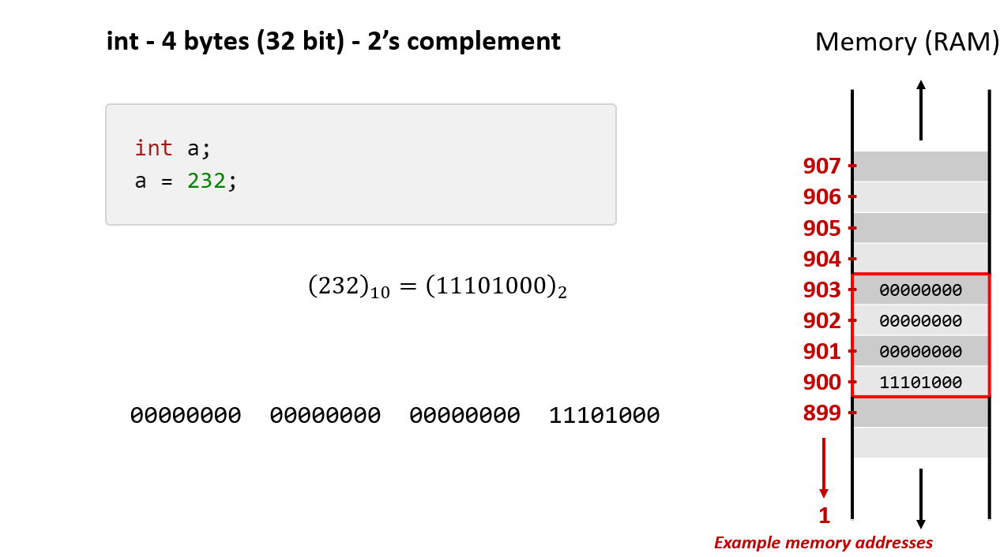
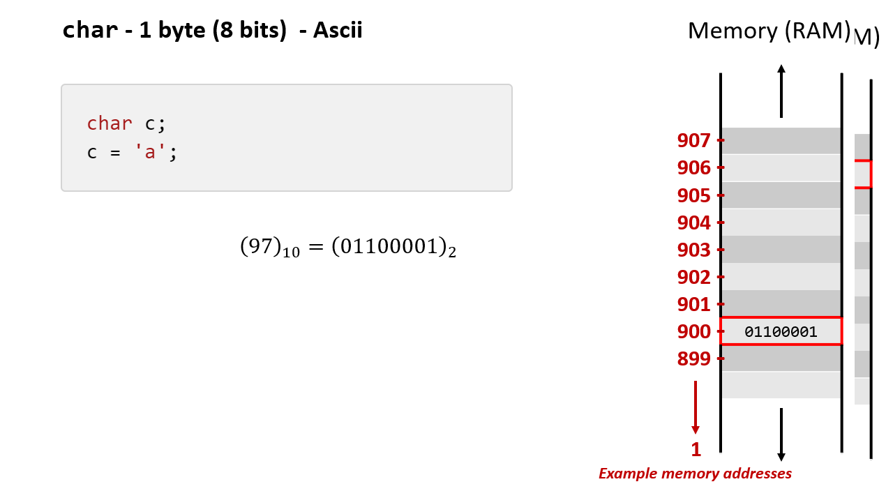
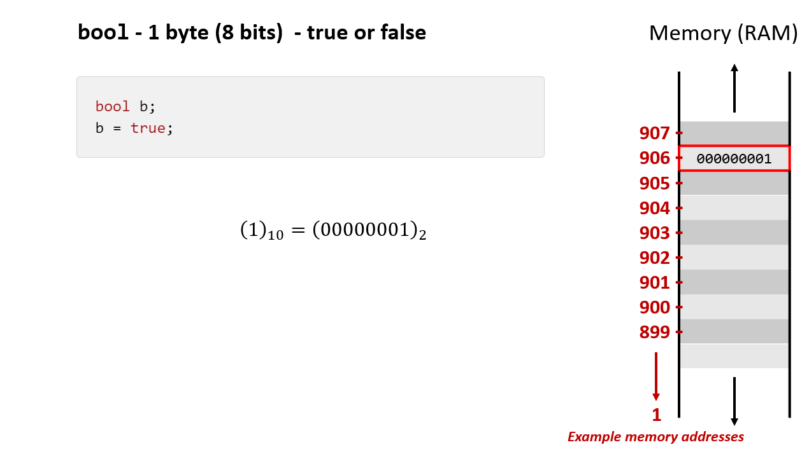
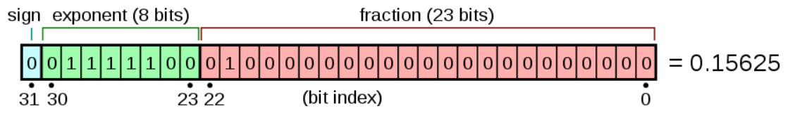
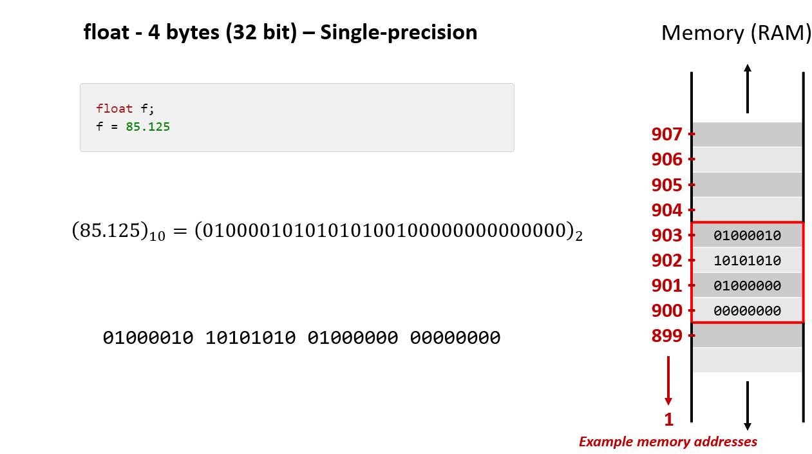
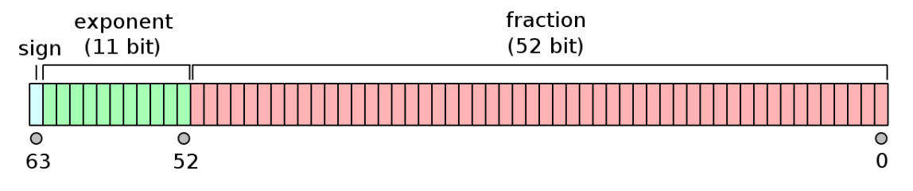

<script type="text/javascript" src="http://cdn.mathjax.org/mathjax/latest/MathJax.js?config=TeX-AMS-MML_HTMLorMML"></script>
<script type="text/x-mathjax-config"> MathJax.Hub.Config({ tex2jax: {inlineMath: [['$', '$']]}, messageStyle: "none" });</script>

# Lecture Notes - Basic Data Types

## Prerequisite Knowledge

- You should understand binary, at least how whole numbers are represented in binary
- a byte of memory is 8 bits. 
- a byte of memory can store 256 different values. There are $2^8$ ways to arrange a binary string of length 8.

## Compilers

I am not teaching you you about compiled vs interpreted code and things like virtual machines. 4CM506 will teach you more about this.

If you are interested though please read this - [https://www.programiz.com/article/difference-compiler-interpreter](https://www.programiz.com/article/difference-compiler-interpreter).

# Introduction

Here we will look at the basic data types available in the C++ programming language and how they are represented in memory.

The reason for this is that we can get closer to the machine code and understand better how data is stored in memory. Python is a very high level programming language and is actual implemented using other programming languages, most commonly C. This means that it is harder to understand what is going on under the hood.

C++ is a programming language which is an extension of the C programming language. For more information on the history please read the following - [C++](https://en.wikipedia.org/wiki/C%2B%2B).

# Hello World in C++

```cpp
#include <iostream>

int main() 
{
   std::cout << "Hello, World!" << "\n";
   return 0;
}
```


# Basic (Primitive) Data Types

We will look at the basic data types and their internal representation in memory.

In C++ there are a number of basic data types. These let you create data to use in your programs to do useful things. For example, we might wish to create a piece of software to represent a shop. Here we would need a way of storing products including how much they cost etc. Generally we would use a database for this kind of storage (more on that later in the year), however we would need to code the interface and the business interactions which would mean working with the data in a programming language.

Generally we will have at least 3 common types of data types across programming languages.

- **Numbers** (this includes integers (whole numbers) and decimals)
- **Characters** (a single character such as `s`)
- **Booleans** (`true` or `false`)

<div style= "page-break-after:always"></div>

Here is a list of the basic data types in C++. I have not listed them all, you can see all of them here - [https://www.programiz.com/c-programming/c-data-types](https://www.programiz.com/c-programming/c-data-types).

| Data Type | Meaning | Size (Bytes) | Size Range | Precision |
|--|--|--|--|--|
|`int`|Integer| 4 (32 bits) | $-2,147,483,647$ to $2,147,483,647$ | Not applicable |
|`float`|Floating-point| 4 (32 bits) | Approximately $-10^{-38}$ to $10^{38}$ | 7 digits |
|`double`|Double Floating-point| 8 (64 bits) | Approximately $-10^{308}$ to $10^{308}$ | 15 digits
|`char` |Character| 1 (8 bits) | All ASCII Characters | Not applicable |
|`bool`|Boolean| 1 (8 bits)| `true`, `false` | Not applicable |

## How they appear in code

```c
```cpp
#include <iostream>

int main() 
{
    int num1 = 3;
    
    // prints the string enclosed in double quotes
    std::cout << num1 << "\n";
    return 0;
}
```


# How are they represented in memory?

Each data type will be stored in contiguous (next to each other) memory. This means if a data type is 4 bytes, it will take up a block of 4 bytes in memory. ***Note this does not necessarily mean all data types will appear in order or in one block of memory. This will depend on the compiler.***

Example `int` (4 bytes) in memory. This is a block of 32 bits of contiguous memory.




Each byte of memory has an associated address so the computer can access it. The above shows them as integers. Commonly we work with hex (base 16). 


The above `int` is actually representing the binary string:

`00000000 00000000 00000000 11101000`

If we convert that we get the integer `232`.

You can test the following using some C++ code on replit.com. I've also made this available in Lab 2.

[https://replit.com/@samtoneill/WhatsInMemory?v=1](https://replit.com/@samtoneill/WhatsInMemory?v=1)

## `char`

```cpp
char c = 'a';
```

A `char` is stored in a single byte. Thus there are 8 bits and $2^8$ possible binary strings. This means we can store 256 different values.

The ACSII table tells us what number (base 10) is mapped to what character.

[https://www.asciitable.com/](https://www.asciitable.com/)

Thus if our single byte in memory held the binary string `01100001` then this is `97` in base 10 and thus represents the character `'a'`.



<div style= "page-break-after:always"></div>

## `bool`

```cpp
bool b = true;
```

A bool only takes on two values `true` or `false`. There is no standard to how they are implemented by the compiler, but they should map to `1` and `0`.

Thus it makes sense to think that a representation like this in memory is sensible.



It turns out that it is quite common for this to be the way that a `bool` is stored.

## `int`

```cpp
int i = 25;
```

As an `int` is 4 bytes (32 bits) we could represent `0` all the way up to `4294967295` (thats the binary string `11111111111111111111111111111111`).

However, we want negative numbers. In C++, by default, `int` is signed. Thus the left most bit (most significant bit) represents the sign (`1` means the integer will be negative). So our range is actually `-2,147,483,647` to `2,147,483,647`.

It uses 2's complement, you can try it on this website - [https://www.omnicalculator.com/math/twos-complement](https://www.omnicalculator.com/math/twos-complement), well worth a play!

`25` in binary is as follows:

$(25)_{10} = (11001)_2$

Internally we use 4 bytes (a byte is 8 bits) to represent an int. So our full representation must have $4\times8=32$ bits. 

$25_{10} = (00000000000000000000000000011001)_{2}$

`00000000 00000000 0000000 00011001` 

So in a machine it looks something like this. Here we are showing the integer $232$.


To represent $(-1)_{10}$ we would need the following

`11111111 11111111 11111111 11111111`

Note the left most bit here represents $-2^{31} = -2,147,483,648$, all other bits are positive. e.g. the second from the left is $2^{30}$, the third from the left is $2^{29}$ etc.

You should try and check these, if you aren't sure how to read about 2's complement or ask!

You can check these using the code in the labs or via this link. You may need to fork this on replit.com. You can also find the code on Course Resources

[https://replit.com/@samtoneill/WhatsInMemory?v=1](https://replit.com/@samtoneill/WhatsInMemory?v=1)

<div style= "page-break-after:always"></div>

## `float`

```cpp
float f = 85.125;
```

Single-precision floating-point is 4 bytes and takes the form:



In the above image,

|||
|--|--|
|Sign | `0` |
|Exponent | `01111101` |
| Mantissa | `01000000 00000000 0000000`|

For the binary string - 

`01000010 10101010 01000000 00000000`

We have:

|||
|--|--|
|Sign | `0` |
|Exponent | `10000101` |
| Mantissa | `01010100 10000000 0000000`|

We calculate the decimal number in base 10 as follows.


- Sign is $0$, therefore positive $+$
- Exponent is $(10000101)_{2} - 127 = 133 - 127 = 6$
- Mantissa - $(1)_{10} + (01010100100000000000000)_2 = 1 + (0 + 0.25 + 0 + 0.0625 + 0 + 0.015625 + 0 + 0 + 0.001953125) = 1.330078125$

Which leads to the final calculuation:

$+1.330078125 \times 2^{-6} = 85.125$

For a more detailed explanation see - [https://www.omnicalculator.com/other/floating-point](https://www.omnicalculator.com/other/floating-point)

In memory this would look like this.



### Converting a number from decimal to floating-point (Additional Reading)

To convert the decimal number $85.125$ to its IEEE 754 single-precision binary representation, we can follow the steps mentioned earlier. Here's the binary representation:

1. **Convert the Integer Part (85) to Binary:**
   - 85 in binary is 1010101.

2. **Convert the Fractional Part (0.125) to Binary:**
   - For the fractional part 0.125, we can multiply by 2 repeatedly to find the binary representation:
     - $0.125 * 2 = 0.25$ -> `0`
     - $0.25 * 2 = 0.5$ -> `0`
     - $0.5 * 2 = 1.0$ -> `1`

    We terminate once we reach $1$.

   So, the fractional part in binary is `0.001`

3. **Combine the Binary Parts:**
   - The combined binary representation is: `1010101.001`

4. **Normalize the Binary Representation:**
   - Normalize it to have a single non-zero digit to the left of the binary point: `1.010101001`. The binary string after the binary point is the mantissa.

5. **Express the Exponent in Bias Format:**
   - The exponent in bias format is 127 (the bias) + 6 (because we moved the binary point six positions to the left) = 133 in binary, which is `10000101`.

6. **Write the Sign Bit:**
   - The number is positive, so the sign bit is `0`.

<div style= "page-break-after:always"></div>

7. **Combine the Components:**
   - Combining the sign bit, the biased exponent, and the normalized binary fraction, we get the IEEE 754 single-precision binary representation:

    |||
    |--|--|
    |Sign | `0` |
    |Exponent | `10000101` |
    | Mantissa | `01010100 10000000 0000000`|
   
     `0 10000101 01010100100000000000000`

Formatted this is the same as previously:

`01000010 10101010 01000000 00000000`

This binary string represents the decimal number $85.125$ in IEEE 754 single-precision format.

You can check via this online calculator:

[https://www.omnicalculator.com/other/floating-point](https://www.omnicalculator.com/other/floating-point)


## `double`

```cpp
double d = 85.125;
```

Double-precision floating-point numbers are the same as single-precision but are stored over 8 bytes to hold larger numbers.



The conversion process is similar except that the exponent is 11 bits and not 8. So we have to subtract 1023 instead of 127.

Note: If you are interested as to why you should do some extra reading.

[https://en.wikipedia.org/wiki/Double-precision_floating-point_format](https://en.wikipedia.org/wiki/Double-precision_floating-point_format)

You can also explore the following - For a more detailed explanation see - [https://www.omnicalculator.com/other/floating-point](https://www.omnicalculator.com/other/floating-point)

<div style= "page-break-after:always"></div>

# Different data types in memory

Note that if we store different types of memory we might get something that looks like this.


Note that depending on your order you may not have contigous memory for all the types. This is because on a 32-bit and 64-bit we have a 4-byte and 8-byte boundary respectively and our data must be aligned to these. This is to improve performance.

This is beyond the scope of this course. We are just understanding that basic types of data are represented by a number of bytes.

The interested student can read this - [https://learn.microsoft.com/en-us/cpp/c-language/alignment-c?view=msvc-170](https://learn.microsoft.com/en-us/cpp/c-language/alignment-c?view=msvc-170) - or do some additional research.