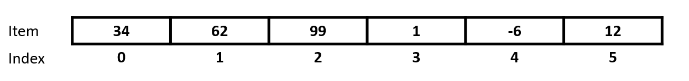
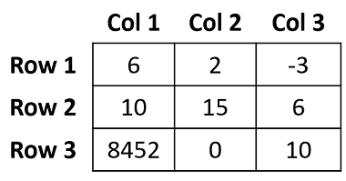
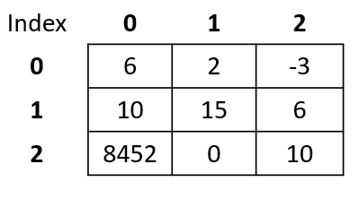
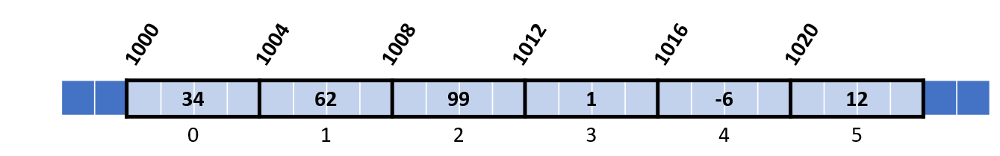

<script type="text/javascript" src="http://cdn.mathjax.org/mathjax/latest/MathJax.js?config=TeX-AMS-MML_HTMLorMML"></script> <script type="text/x-mathjax-config">     MathJax.Hub.Config({ tex2jax: {inlineMath: [['$', '$']]}, messageStyle: "none" }); </script>

- Tick off each thing as we go to keep track

# Announcements

- Clinic 1-4pm on Weds in MS005
- Not expected to understand complex c++ code, just use it to investigate
- First MCQ Quiz!

# Review of basic data types

Show week 2 notes and annotate in PDF

# 1. Basic Reasons for Arrays

- Sometimes we need to store collections of data.
- e.g. We might need to store the high scores in a game
- e.g. We might want to store student grades. 

**SHOW grades_1d_example.cpp**

The point is we get to a point in our programs where we need to store similar data together that is in some way connected. These are commonly referred to as **Data Structures**.

**Arrays are the fundamental building block of many other data structures.**



**SHOW SLIDE 1 of array_images.pptx**

<div style="page-break-after:always"></div>

# 2. Example of how to create an array in C++

Here is a simple C++ program that stores the marks of 6 students, we can then access these marks using the `index`. Indexing starts at `0`. So the first item is at position `0`

```cpp
#include <iostream>

int main() 
{
    int studentMarks[6] = {85, 92, 78, 96, 88, 90};

    // Display individual marks
    std::cout << "First Student Mark:" << studentMarks[0] "\n";

    std::cout << "Second Student Mark:" << studentMarks[1] "\n";
    return 0;
}
```

Remember we can declare in different ways.
```cpp
int myArray[5]; // Declaration without initialization - 5 elements
int myArray[5] = {1, 2, 3, 4, 5}; // Declaration with initialization  - 5 elements
int myArray[] = {1, 2, 3, 4, 5}; // Declaration with initialization, size inferred by the compiler - 5 elements
char myString[3] = {'s','a','m'}; // an array of chars representing my name sam - 3 elements
```

We can also loop over the array and print out all the elements in order.

```cpp
#include <iostream>

int main() 
{
    int studentMarks[6] = {85, 92, 78, 96, 88, 90};

    // Display individual marks
    std::cout << "Student Marks:\n";

    for (int i = 0; i < numStudents; ++i) 
    {
        std::cout << "Student " << (i + 1) << ": " << studentMarks[i] << "\n";
    }

    return 0;
}
```

In this code:

    1. We define an array `studentMarks` that stores the marks of 6 students.

    2. We use a loop to display each of the student's marks 

When you run this program, it will display the individual marks and the average mark of the 6 students.

<div style="page-break-after:always"></div>

# 3. In C, Strings are `char` Arrays

We already saw an array of type `char` in the previous section.

- In C, strings are represented as arrays of characters (`char`). We can also do the same in C++ as well.

- Example:

```cpp
char greeting[] = "Hello, World!";
```

Note: C++ provides a string type, but it includes an additional library and has extra functionality baked in. **These are not arrays!**

```cpp
// Include the string library
#include <string>

// Create a string variable
std::string greeting = "Hello, World!";
```

[https://www.w3schools.com/cpp/cpp_strings.asp](https://www.w3schools.com/cpp/cpp_strings.asp)

<div style="page-break-after:always"></div>

# 4. Example of how to create a 2d array in C++

- **SHOW battleships_2d_example.cpp**

- **SHOW array_images.pptx slide 2**

A two-dimensional array is like a table of data.



In C++ we index from `0`.



Thus `6` is stored at row 2 (index `1`) and column 3 (index `2`).

Here is the above in C++.

```cpp
int table[3][3] = {{6, 2, -3},
                  {10, 15, 6},
                  {8452, 0, 10}};

// Display row
std::cout << "Row 3, Column 1:" << table[2][0] "\n"; // outputs 8452
```

<div style="page-break-after:always"></div>

```cpp
// this could be 3 tests each with 2 scores.
int test[3][2] = {{2, -5},
                    {4, 0},
                    {9, 1}};

// Display test 1 mark 1
std::cout << "First Test, First mark:" << test[0][0] << "\n"; // outputs 2

// Display test 2 mark 2
std::cout << "Second Test, Second mark:" << test[1][1] "\n"; // outputs 0
```

```cpp
// C++ Program to display all elements
// of an initialised two dimensional array

#include <iostream>
using namespace std;

int main() {
    int test[3][2] = {{2, -5},
                      {4, 0},
                      {9, 1}};

    // use of nested for loop
    // access rows of the array
    for (int i = 0; i < 3; ++i) {

        // access columns of the array
        for (int j = 0; j < 2; ++j) {
            cout << "test[" << i << "][" << j << "] = " << test[i][j] << endl;
        }
    }

    return 0;
}
```
<div style="page-break-after:always"></div>

# 5. How is it represented in memory

- **SHOW array_images.pptx slide 3 and 4**

- **Show 1d demo using code - printArray1dMemory.cpp via [](https://www.programiz.com/cpp-programming/online-compiler/)**

- **Show 2d demo using code - printArray2dMemory.cpp via [](https://www.programiz.com/cpp-programming/online-compiler/)**

# 6. Retrieving Elements in an Array

**SHOW array_images.pptx SLIDE 5**

```cpp
int myIntArray[6] = {34, 62, 99, 1, -6, 12};
```
Therefore this will take up $4\times6 = 24$ bytes of contiguous memory.

The memory layout for this array would look like this (addresses would be different):



- Each item has an `index`
- The starting memory address is known as the `base` address.
- The size of the type being stored is the `offset`. Here it is 4 bytes.

Therefore the starting address of any item is given by:

`item_address = base + index*offset`

e.g. 

- The value `99` has an `index` of `2`. 
- The `base` address is `1000`
- The `offset` is `4`.

The item address of `99` is then `1000 + 2*4 = 1008`.

This means we can find `99` at the contiguous memory locations `1008`, `1009`, `1010` and `1011`.


```cpp
#include <iostream>

int main() 
{
    int myIntArray[6] = {34, 62, 99, 1, -6, 12}; // Create an array of 10 integers

    // Calculate the base address of the array
    int* baseAddress = &myIntArray[0];

    std::cout << baseAddress << std::endl;

    return 0;
}
```

# 7. Summary

**SHOW array_images.pptx slide 6**