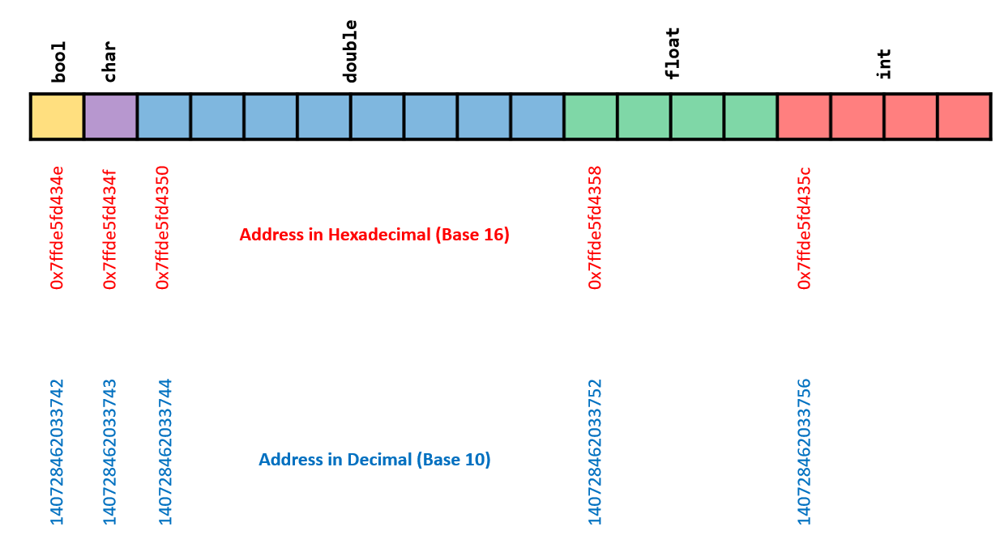

# Instructions  

Please make sure you complete these exercises and the MCQ quiz on Blackboard.

**The MCQ quiz is assessed! See Blackboard for the deadline.**

You can use the following tutorials for reference for the exercises.

[https://www.programiz.com/cpp-programming/data-types](https://www.programiz.com/cpp-programming/data-types)

[https://www.programiz.com/cpp-programming/input-output](https://www.programiz.com/cpp-programming/input-output)

***If you are doing these exercises on the replit.com course you can check your answers using the Tests. Note these are just for your use, they are not assessed like 4CM504 (Programming).***

```cpp
#include <iostream>

int main() {
    // prints the string enclosed in double quotes
    std::cout << "Hello World";
    return 0;
}
```

# Exercise 2.1

Create the following data types. 

| Type | Name | Value |
| :--: | :--: | :--: |
|`int`|`num1`|`3`|
|`float`|`num2`|`3.1`|
|`double`|`num3`|`3.142`|
|`char`|`char1`|`'c'`|
|`bool`|`bool1`|`true`|

It is always wise to name you variables using sensible names that mean something. The choices above are limited because we don't have much context in our program. 

A good example would be a variable that stored the price of an item. A sensible name would probably then be `price`!

Below is example code to get you started.

```cpp
#include <iostream>

int main() {

    int num1 = 3;
    
    // prints the string enclosed in double quotes
    std::cout << "Hello World";
    return 0;
}
```


# Exercise 2

**Print out to the console the size and memory location of each of the data types.**

Depending on the compiler you might get different results. On this platform we actual have these data types stored in contiguous memory like so.

You can print out the size and the memory location. We will also need the `sizeof()` function and the address operator `&`.

You should read through the following to understand the code presented below -
[https://www.programiz.com/c-programming/c-input-output](https://www.programiz.com/c-programming/c-input-output)


Use this line of code to print out the size and memory location of each of the variables. Just replace `num1` with the name of your variable.

```cpp
#include <iostream>

int main() {

    int num1 = 3;

    std::cout << "Size of int num1 is " << sizeof(num1) << " bytes.\n";
    std::cout << "int num1 is stored at memory location " << (void*)&num1 << "\n";
}
```

The use of `void*` here is a peculiarity with C++, `std::cout` and C. 

Just duplicate the code and replace `num1` everywhere in the code with another variable name. Like `num2`. Do the same for the other variables.

# Exercise 3

When you created your variables of different types they will each have been stored in contiguous memory like so. **Each type may not be stored contigously depending on their order. This is to do with the architecture.**.



1. Find out what the starting memory locations are when you run your code.
2. Convert these to decimal and check that this is something similar to the above.

To convert to decimal remove the 0x from the front of the address and use this calculator.

You should notice that the addresses go up by 4 bytes, 8 bytes or 1 byte. You will also notice that these read 

# Exercise 4

Try converting the following to the binary representation in memory. For those of you who like maths, do this using paper. Alternatively use the following calculators.

https://www.omnicalculator.com/math/twos-complement
https://www.omnicalculator.com/other/floating-point
https://www.asciitable.com/

For example `201` as an `int` will be the following 4 byte (32 bit) binary number:


Convert the following:

| Value | Type | Size in memory | Method |
|--|--|--|--|
|`3014`|`int`|4 bytes (32 bits)|2's complement|
|`201.45`|`float`|4 bytes (32 bits)|Single-precision floating-point|
|`201.45`|`double`|8 bytes (64 bits)|Double-precision floating-point|
|`'a'`|`char`|1 byte (8 bits)|Ascii|

You can check this using the Print Binary Representation Repl that I have included in this lab.