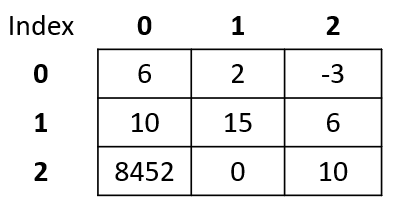

<script type="text/javascript" src="http://cdn.mathjax.org/mathjax/latest/MathJax.js?config=TeX-AMS-MML_HTMLorMML"></script> <script type="text/x-mathjax-config">     MathJax.Hub.Config({ tex2jax: {inlineMath: [['$', '$']]}, messageStyle: "none" }); </script>

# Lecture Notes: Arrays in C++

**YOU ARE NOT SUPPOSED TO UNDERSTAND THE LARGE BITS OF CODE IN THESE NOTES, THEY ARE THERE FOR REFERENCE.**

***Please note I will use the term element and item interchangably. This is deliberate as people use both frequently when talking about arrays.***

You can also follow the tutorials on arrays from Programiz:

[One-Dimensional Arrays](https://www.programiz.com/cpp-programming/arrays)

[Two-Dimensional Arrays](https://www.programiz.com/cpp-programming/multidimensional-arrays)

# Introduction to Arrays

- **Definition:** An array is a collection of elements of the same data type, stored in contiguous memory locations.

- **Rationale:** Arrays are used to store and manipulate a collection of data items of the same type efficiently. They provide easy access to individual elements by their index.

- **Motivation:** Sometimes we need to store collections of data.
    - e.g. We might need to store the high scores in a game
    - e.g. We might want to store student grades. 
    - Feel free to try the two C++ files provided with these notes on [Programiz Online Compiler](https://www.programiz.com/cpp-programming/online-compiler/) to see two applications using arrays.

    The point is we get to a point in our programs where we need to store similar data together that is in some way connected. These are commonly referred to as **Data Structures**.

For example we might want to store 6 numbers in memory together. For example, they could be the high scores in a game.


## Quick Array Facts

- A fixed block of contiguous memory (more on that later)
- Stores a fixed number of items with a fixed size (number of bytes)
- Items are of the same type (e.g. `int`)
- Each element (item) in an array has an associated index. In C++ the indexing starts at `0`.
    - e.g. the 3rd element in an array has an index of `2`.

<div style="page-break-after:always"></div>

# Declaration and Initialization in C++

## Declaration

In C++, you declare an array using the following syntax:

```cpp
dataType arrayName[arraySize];
```

- `dataType`: The type of elements the array will hold (e.g., `int`, `double`, `char`).
- `arrayName`: The identifier for the array.
- `arraySize`: The number of elements in the array.

## Initialization

Arrays can be initialized during declaration or later in the code:

```cpp
int myArray[5]; // Declaration without initialization - 5 elements
int myArray[5] = {1, 2, 3, 4, 5}; // Declaration with initialization  - 5 elements
int myArray[] = {1, 2, 3, 4, 5}; // Declaration with initialization, size inferred by the compiler - 5 elements
char myString[3] = {'s','a','m'}; // an array of chars representing my name sam - 3 elements
```

# Accessing Array Elements

- Array elements are accessed using indices, starting from 0.
- Example: `myArray[0]` accesses the first element of `myArray`.

## Array Bounds

- Array indices should be within the bounds of the array to avoid accessing memory outside the array, which can lead to undefined behavior.

## Examples

```cpp
int numbers[3] = {10, 20, 30};
std::cout << numbers[0]; // Output: 10
std::cout << numbers[1]; // Output: 20
std::cout << numbers[2]; // Output: 30

std::cout << numbers[3]; // This will output something odd. You have walked off the end of the array into other memory allocated for something else!
```

# In C, Strings are Arrays

We already saw an array of type `char` in the previous section.

- In C, strings are represented as arrays of characters (`char`). We can also do the same in C++ as well.

- Example:

```cpp
char greeting[] = "Hello, World!";
```

Note: C++ provides a string type, but it includes an additional library and has extra functionality baked in. **These are not arrays!**

```cpp
// Include the string library
#include <string>

// Create a string variable
std::string greeting = "Hello, World!";
```

[https://www.w3schools.com/cpp/cpp_strings.asp](https://www.w3schools.com/cpp/cpp_strings.asp)

# Multidimensional Arrays

In C++, arrays can have multiple dimensions, which allows you to create matrices or tables to store and organize data in a grid-like structure. One of the most common multidimensional arrays is the 2D array. Let's explore this concept with an example:

## Example: 2D Array (Matrix)

```cpp
int table[3][3] = {{6, 2, -3}, {10, 15, 6}, {8452, 0, 10}};
```

Viewed as a table, this 2D array looks like the following:


## Accessing Elements

When working with a 2D array, you access each element by specifying both the row and column indices. In the example above, the element at row 2 and column 3 (denoted as `table[1][2]`) contains the value 6. **It is important to note that the indexing starts at `0`**.



Here's how you can access elements:

```cpp
int element = table[row_index][column_index];
```

For instance, to access the value `15` in the table above we would initialise the array and access row 2, column 2:

```cpp
int table[3][3] = {{6, 2, -3},
                  {10, 15, 6},
                  {8452, 0, 10}};

int value = table[1][1]; // Row 2, Column 2 which is 15
```

e.g. we could store 3 tests each with 2 scores.

```cpp
// this could be 3 tests each with 2 scores.
int test[3][2] = {{2, -5},
                    {4, 0},
                    {9, 1}};

// Display test 1 mark 1
std::cout << "First Test, First mark:" << test[0][0] << "\n"; // outputs 2

// Display test 2 mark 2
std::cout << "Second Test, Second mark:" << test[1][1] "\n"; // outputs 0
```

You can also use loops to iterate through the elements of a 2D array, making it easier to perform operations on the entire matrix or table:

```cpp
for (int row = 0; row < 3; ++row) {
    for (int col = 0; col < 3; ++col) {
        std::cout << table[row][col]; // print each row and column value
    }
}
```

This nested loop will traverse each element of the 2D array, allowing you to process the data efficiently.

<div style="page-break-after:always"></div>

# Implementation Details

## Contiguous Memory

- Arrays in C++ are implemented as a block of contiguous memory (see image below). This means that the elements are stored in adjacent memory locations, making it easy to access them sequentially using index notation.


- Let's consider an example of an array of integers, where each integer occupies 4 bytes. Suppose you have the following declaration:

```cpp
int myIntArray[6] = {34, 62, 99, 1, -6, 12};
```
Therefore this will take up $4\times6 = 24$ bytes of contiguous memory.

The memory layout for this array would look like this (addresses would be different):


For example the following array:

```cpp
int numbers[] = {34, 62, 99, 1, -6, 12};
```

Would appear in memory like this (remember the element addresses might be different, but they would be in contiguous memory, separated by 4 bytes).

```
Element Address              Element    Bytes Contents (8-bit binary)
0x7ffd1e1b5c90                  34      00100010  00000000  00000000  00000000  
0x7ffd1e1b5c94                  62      00111110  00000000  00000000  00000000  
0x7ffd1e1b5c98                  99      01100011  00000000  00000000  00000000  
0x7ffd1e1b5c9c                   1      00000001  00000000  00000000  00000000  
0x7ffd1e1b5ca0                  -6      11111010  11111111  11111111  11111111  
0x7ffd1e1b5ca4                  12      00001100  00000000  00000000  00000000  
```

<div style="page-break-after:always"></div>

Remember that these are stored in little endian order, so for example, $4000$ is stored as:

`10100000  00001111  00000000  00000000`

To represent this as a binary string we need to reverse each of the bytes (8 bit strings):

`00000000  00000000  00001111  10100000`

If you stick this into a 2's complement calculator or work it out you will get $4000$.

***If you are really curious you can see the code that produced this below. You are not expected to understand this**

```cpp
#include <iostream>
#include <bitset>
#include <iomanip>

int main() {
    int numbers[] = {34, 62, 99, 1, -6, 12};
    int arraySize = sizeof(numbers) / sizeof(numbers[0]);

    std::cout << "Element Address" << std::setw(21) << "Element" << std::setw(33) << "Bytes Contents (8-bit binary)" << std::endl;

    for (int i = 0; i < arraySize; ++i) {
        // Print the address of the element in the 1D array
        std::cout << &numbers[i] << std::setw(20) << numbers[i] << std::setw(14);
        
        // Print the contents of each byte within the element as 8-bit binary
        unsigned char* bytePtr = reinterpret_cast<unsigned char*>(&numbers[i]);
        for (int j = 0; j < sizeof(int); ++j) {
            std::cout << std::bitset<8>(bytePtr[j]) << "  ";
        }

        std::cout << std::endl;
    }

    return 0;

    std::cout << "\n\nREMEMBER THAT THE BINARY STRING IS STORED IN LITTLE ENDIAN ORDER - TO CONVERT IT TO A BINARY STRING WRITE THE BYTES IN REVERSE" << std::endl;
    
    std::cout << "\n\nE.g. \n00110100  01001010  00000001  00000000\n" << "00000000  00000001  01001010  00110100 = 84532" << std::endl;
}
```
<div style="page-break-after:always"></div>

## What About Multidimensional Arrays?

They are just represented by a one-dimensional array where all the rows of the 2d array are stacked together. 

For example,


would be flattened to the one-dimensional array:


For example the two-dimensional array,

```cpp
int matrix[3][3] = {{6, 2, -3}, {4, 5, 6}, {84532, 0, 10}};
```
might be stored as follows
```
Element Address              Element    Bytes Contents (8-bit binary)
0x7ffd5e9e9480                   6      00000110  00000000  00000000  00000000  
0x7ffd5e9e9484                   2      00000010  00000000  00000000  00000000  
0x7ffd5e9e9488                  -3      11111101  11111111  11111111  11111111  
0x7ffd5e9e948c                   4      00000100  00000000  00000000  00000000  
0x7ffd5e9e9490                   5      00000101  00000000  00000000  00000000  
0x7ffd5e9e9494                   6      00000110  00000000  00000000  00000000  
0x7ffd5e9e9498               84532      00110100  01001010  00000001  00000000  
0x7ffd5e9e949c                   0      00000000  00000000  00000000  00000000  
0x7ffd5e9e94a0                  10      00001010  00000000  00000000  00000000 
```

<div style="page-break-after:always"></div>

***Again, if you are really curious you can see the code that produced this below. You are not expected to understand this***

```cpp
#include <iostream>
#include <bitset>
#include <iomanip>

int main() {
    int matrix[3][3] = {{1, 2, 3}, {4, 5, 6}, {7, 84532, 9}};
    int numRows = sizeof(matrix) / sizeof(matrix[0]);
    int numCols = sizeof(matrix[0]) / sizeof(matrix[0][0]);

    std::cout << "Element Address" << std::setw(21) << "Element" << std::setw(33) << "Bytes Contents (8-bit binary)" << std::endl;

    for (int row = 0; row < numRows; ++row) {
        for (int col = 0; col < numCols; ++col) {
            // Print the address of the element in the 2D array
            std::cout << &matrix[row][col] << std::setw(20) << matrix[row][col] << std::setw(14);

            // Print the contents of each byte within the element as 8-bit binary
            unsigned char* bytePtr = reinterpret_cast<unsigned char*>(&matrix[row][col]);
            for (int j = 0; j < sizeof(int); ++j) {
                std::cout << std::bitset<8>(bytePtr[j]) << "  ";
            }

            std::cout << std::endl;
        }
        
    }
    std::cout << "\n\nREMEMBER THAT THE BINARY STRING IS STORED IN LITTLE ENDIAN ORDER - TO CONVERT IT TO A BINARY STRING WRITE THE BYTES IN REVERSE" << std::endl;
    
    std::cout << "\n\nE.g. \n00110100  01001010  00000001  00000000\n" << "00000000  00000001  01001010  00110100 = 84532" << std::endl;
    
    return 0;
}
```

<div style="page-break-after:always"></div>

## Retrieving Elements in an Array

All that needs to be stored for access to elements in memory is the size of the array, the type it stores and starting address of the first bit of data in the array. Here `1000`.


- Each item has an `index` - size is 6 elements, so we can use indices `1,2,3,4,5,6`.
- The starting memory address is known as the `base` address. Here `1000`.
- The size of the type being stored is the `offset`. Here it is 4 bytes.

Therefore the starting address of any item is given by:

`item_address = base + index*offset`

e.g. 

- The value `99` has an `index` of `2`. 
- The `base` address is `1000`
- The `offset` is `4`.

The item address of `99` is then `1000 + 2*4 = 1008`.

This means we can find `99` at the contiguous memory locations `1008`, `1009`, `1010` and `1011`.

**NOTE: We would need an amended formula to work out a multidimensional array, but we won't worry about that in this course.**

You can see how to get the base address of an array using the C++ code below:

```cpp
#include <iostream>

int main() 
{
    int myIntArray[6] = {34, 62, 99, 1, -6, 12}; // Create an array of 10 integers

    // Calculate the base address of the array
    int* baseAddress = &myIntArray[0];

    std::cout << baseAddress << std::endl;

    return 0;
}
```

<div style="page-break-after:always"></div>

# Summary

- Arrays are fundamental data structures.
- They allow us to efficiently access and store data.
- Arrays are stored in contiguous memory.
- Arrays are homogeneous - they store the same data type, e.g. `int`.
- Arrays are allocated a fixed contiguous chunk of memory. For example an array of 6 integers (int) we occupy $4\times6=24$ bytes of contiguous memory.
- At a low level, we get access to elements of an array by taking the base address and calculating the address of the index we want to retrieve. 

--- 

