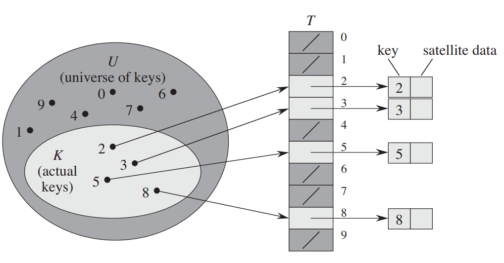
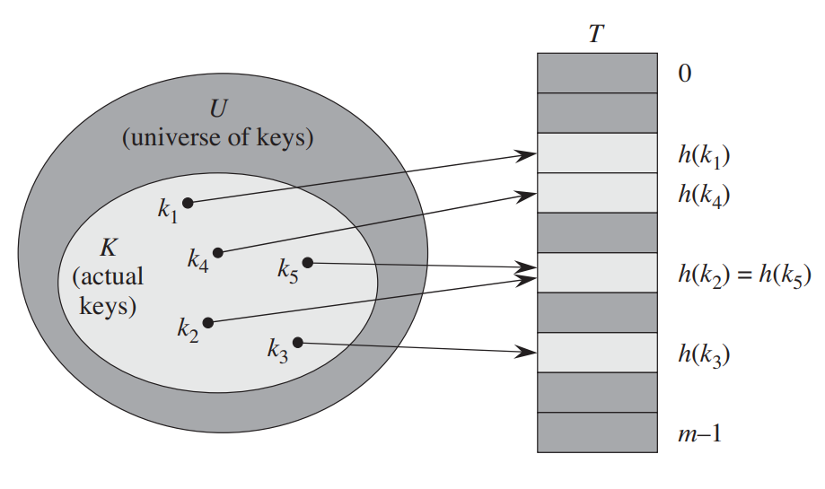
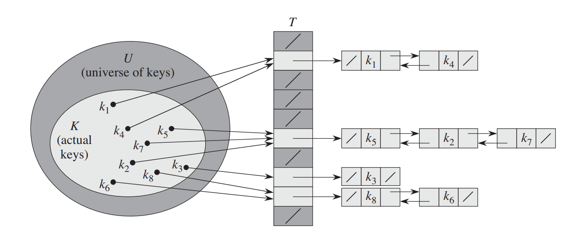
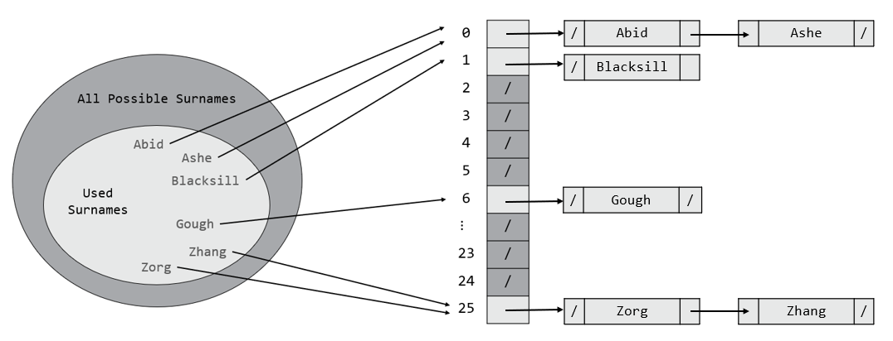
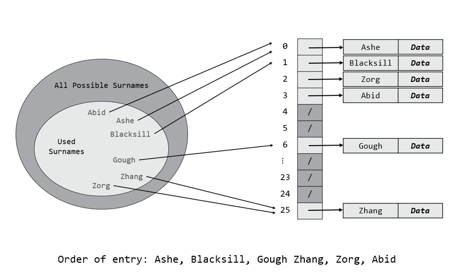

<center>

# Lecture 11 - Hashing, Hash Tables and Map (ADT)

## Computer Systems, Data Structures, and Data Management (4CM508)

### Dr Sam O'Neill

</center>

---

We will not do a detailed analysis on this topic, if you are interested there is plenty online or can look at Introduction to Algorithms (See References at the end of slides)

---

# Sorting and Searching

We have already seen that searching is expensive. We will also see that sorting is expensive too.

Using an array or linked list requires searching and/or sorting to retrieve items based on a value.

---

# Alternative - Don't Sort or Search!

- One option is to not spend time searching or sorting.
- Provide a key that gives access to some data.

## Example

Ignoring Google Maps etc...

- **Address without a postcode** - You have to do some searching on a map.

- **With postcode** - You can find it easier.

- **Latitude and longitude** - You can find it quickly and precisely.

---

# Map (ADT)

- An abstract data type (ADT) that stores key-value `(k,v)` pairs
- No duplicate keys

<div>

| Name | Description |
|--|--|
|`create(X)`| create a map from a sequence `X` of key-value pairs `(k,v)` |
|`size()`| return the size of the map|
|`get(k)`| return the entry stored with key `k`|
|`put(k,v)`| add `v` to the map, stored with key `k`<br><br> if key already exists replace item with `v`|
| `remove(k)`|delete the item stored at key `k` and delete the key `k`|

</div>


---

# Python Dictionaries

Python dictionaries are an implementation of the Map (ADT).

Let's code.

---

# How? Storing Values with Keys

We need some way of storing a value with a key.

How could we implement this?

---

# Direct Addressing

We can simply use an array. What is the problem here?

<style>
#direct_add_img img{
  height:400px
}
</style>

<div id="direct_add_img">



</div>

---

# Issues with Direct Addressing

- Do we know all the keys?
- Are the keys of the same type? e.g. Integer, String, Boolean
- Is the set of all keys finite?

Thus we need a way of storing an unknown size of keys in a finite(fixed-size) data structure. How?

---

# Hashing

**Hashing** or the use of **Hash functions** is a way of taking a set of items of any size and mapping them to a fixed-size set of values.

## Example

We can take all students in this room and map them to 26 items. How?


---


---

# Simple example

Map all the integers to 10 values. This is an infinite set of keys!

How?


---

# Hash Function Pictorially

In general you can take a set of keys $U$ of size $|U|$ and map it to another set ${0,1,2,\dots, m-1}$

Formally $h:U\to \{0,1,2,\dots, m-1\}$

<style>
#hash_func_img img{
  height:350px
}
</style>

<div id="hash_func_img">



</div>

---

# Hash Tables


A Hash Table is a way of implementing the Map (ADT).

If you like, it's how we create dictionaries in Python, C# etc...


---

# Phone Book Example

- Surname used as key
- Phone Number stored as value
- Array of size $26$
- We will hash the Surname using our previous idea
   - e.g. O'Neill -> take 'O' which maps to $14$. So store my address at index $14$.


What is the issue here?


---

# Collisions

Sometimes two keys will map to the same value. Let's take our surname example.


Clearly both `"O'Neill"` and `"Olson"` map to `14`.

If we store the phone numbers in an array with size $26$ then we can't store both of their phone numbers!

Note if a hash function $h$ maps a set of keys $U$ of size $|U|$ to a set containing $m$ keys. 

If $m < |U|$, then collisions are guaranteed. Why?

## Question

What should we do?

---

# Dealing with Collisions

To create a useful hash table we need to deal with the following:

- We need a **hash function** that **avoids collisions**
- We need something **big enough** to store data
- We need something **not too big** that we waste space
- We need something that can **manage collisions** when they happen

Let's start by addressing:

- We need a hash function that avoids collisions

---

# What Makes a Good Hash Function?

Uniformity! Avoid as many collisions as possible!

If a lot of your keys map to a given value, then you have something that becomes inefficient.

What about using this hash function to store items in an array of size 10?

```python
  def rubbish_hash(x):
    return 1
```


---

# Comparison of Hash Functions

- numbers 0-9999 randomly generated 1000 times.
- 4 hash functions compared.


---

How do we address the following?

- We need something big enough to store data
- We need something not too big that we to waste space
- We need something that can manage collisions

---

# Closed Addressing (Chaining)

- Each location in the array is called a bucket.
- Maintain a chain of items whose keys map to the bucket. Known as **separate chaining**.
- Normally done using a linked list.

<style>
#chaining_img img{
  height:300px
}
</style>

<div id="chaining_img">



</div>

---




---

# Cost of Closed Addressing

- It takes $O(1)$ to lookup (access) a key.
- Worst-case time complexity of searching the chain (linked list) is $O(n)$

Therefore a worst-case time complexity of $O(n)$ for `get`, `put` and `remove`.

However, keep the linked lists small and you will get on average, constant time - $O(1)$.

---

# Open Addressing

- Each location in the array is a bucket. 
- Hash the key to find it's bucket, if occupied find the next free bucket.

What do we mean by next free bucket?

---

# Linear Probing (Open Addressing)

***There are other types of probing***

Next free bucket is just found linearly.

e.g. keep looking at the next bucket until you find a free bucket.

---




What is the cost of looking up Zhang and Zorg?

---

# Primary Clustering 

Linear probing can lead to long runs of slots built up.

<style>
#clustering_img img{
  height:430px
}
</style>

<div id="clustering_img">


</div>

---

# Cost of Open Addressing (Linear Probing)

- It takes $O(1)$ to lookup (access) a key.
- Worst-case time complexity of searching the array is $O(n)$

Therefore a worst-case time complexity of $O(n)$ for `get`, `put` and `remove`.

However, on average, we get constant time - $O(1)$. 
- Assuming we have a good hash function that distributes uniformly.

---

# Resizing 

- Clearly in open addressing, if the array fills up, then we have to resize!
- Also at about 70% full, things get inefficient. We see a lot more collisions in both open and closed addressing.

We resize based on the **load factor**.

$\frac{n}{k}$

where

- $k$ is number of buckets in array
- $n$ is number of occupied buckets

It is common to resize when $\frac{n}{k} \geq 0.7$. i.e. resize when $70\%$ of the buckets are occupied.

--- 

# Rehashing

As a result of a resize you will need a new hash function.


If you had the following hash function that worked for an array of size $10$.

```python
def h1(x):
  return x % 10
```

You could double the array to $20$, but would need a new hash function, e.g.

```python
def h2(x):
  return x % 20
```

So if we had hashed the key `15` with `h1` we would have tried to store it in bucket `5`.

Now we rehash, `h2(15) = 15`, so we store it in buket $15$ of the new array.

---

Thus you have to rehash existing items and move them to the correct key location.

This is expensive.

We won't do the analysis in this course.

---

# Closed 'vs' Open Addressing

## Closed Addressing (Chaining)

- Typically performs better with high load factor.

- No issues with clustering.


## Open Addressing

- No size overhead apart from the hash table array.
- Better memory locality.
 and cache performance. All elements contiguous.
- Performs better than closed addressing when the number of keys is known.

---

# Map (ADT) Recipe

- Create a hash function that maps keys to an index
- Create an array the size of the set produced by the hash function
- Use either open or closed addressing to solve collisions

---

# An Implementation in Python

I have implemented a basic hash table using a doubly linked list. 

This is by no means efficient, but it is much better than direct addressing!

- Try it out
- Can you improve it?

---

# Python Dictionaries

How are they implemented?

See the following link, but essentially they:

- Use Open Addressing
- Random Probing
- Resize when they are $\frac{2}{3}$ full.

https://stackoverflow.com/questions/327311/how-are-pythons-built-in-dictionaries-implemented

---

# Other Uses for Hashing

- Crypotography
  - Digital signatures
  - Encryption
  - Authentication
- Databases
  - Retrieving via the index column
- Load balancing
- Fraud detection


---

# Summary

- Hash function maps a set of keys $U$ to another set of size $m$
  - A good hash function is uniform
- Hash Table is a data structure
  - Used to implement a Map (ADT)
- Open Addressing uses an array and probing
- Closed Addressing uses an array, a chain (linked list)
- Average time is $O(1)$ for `get`, `put` and `remove`

---

# References

Cormen, T.H., Leiserson, C.E., Rivest, R.L. and Stein, C., 2022. Introduction to algorithms. MIT press.
