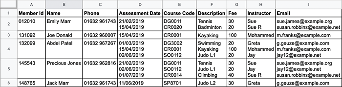
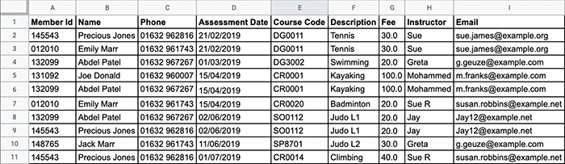
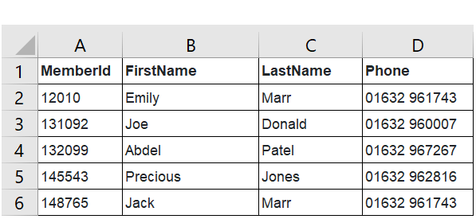
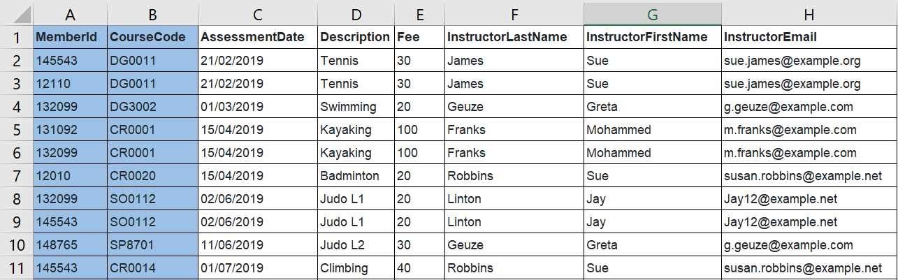
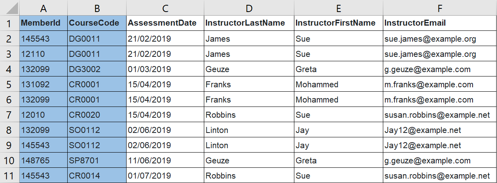

# Lecture 15 - Database Normalisation

**Normalisation** is a technique used to help reduce data duplication when designing data structures, also resulting in an improvement in data integrity.

In his seminal work on relational databases, Edgar F. Codd proposed a three-stage process, in which each stage progresses through a **normal form**. Although his work was extended — you may find references to other stages in textbooks or online — a database is generally considered normalised if it meets the third normal form (3NF). For your exams, you will only need to normalise to 3NF.

The definition of each normal form is as follows:

| | |
|--|--|
|**1NF** | <ul><li>Each record has a primary key</li><li>Data is atomic</li><li>No repeating groups of attributes</li></ul> |
|**2NF**| No partial dependencies |
|**3NF**| No non-key (transitive) dependencies |

## 1. Normalisation: Worked example

To work through an example, let's revisit the sports club scenario.

If a 'flat file' approach has been taken to storing the data about members and their certificates, the instructor might use a spreadsheet or even a word-processed document.

The example above provides **a record for each member**, and the data extends over multiple lines. Holding the data like this would allow the instructor to sort and filter on member details but it would not be possible to work with the certificate data, as there are multiple values in each cell.

Another approach would be to structure the data so that each row represented the award of a certificate. This would require the member’s details to be repeated on each row as shown below.

There is nothing wrong with either of these approaches when there are just a few records to manage. However, it is not the most efficient way to hold the data; it would be hard to analyse and there is an unnecessary duplication of data. In a large system, data duplication can cause problems as data can become inconsistent (as previously described). If you examine the data carefully, you might spot some inconsistencies.

To design a more efficient system, the data must be stored in one or more interlinked tables and each table must be in third normal form.

Normalisation has a reputation for being difficult, but the fundamental principle is that there must be a table for each entity and, within each record, each attribute must be **fully dependent** on the primary key.

## 2. What is a dependency?

Before you study the rules for normalisation, it is important to understand what is meant by the term dependency. In the context of database design, dependency should be understood as **a value that varies in line with another value**.

In the flat file example, you can see that the course description varies in line with the course code. Whenever you see the code 'CR0001', you find the description name 'Lifeguard level 1'. You can therefore say that the course description is dependent on the course code.

However, you must be careful not to assume a dependency. Any assumption(s) should always be checked with someone who understands the organisation and the existing system. If you don’t get your design right, you may find that the database structure will need to be changed, which can result in a lot of extra work.

## 3. First normal form (1NF)

To decide whether the data is in first normal form (1NF), you must check that the data conforms to the criteria below:

- Each record must have a primary key
- The data in each field (column) must be atomic
- Each record must have no repeating groups of attributes

Consider the original flat file again:

### Does each record have a primary key?

Looking at the data, you can see that this condition is satisfied; ``MemberId`` is unique to each record so can be designated as the primary key.

If there had been no single attribute or combination of attributes that could be guaranteed to be unique for each entity, a new attribute would be needed for the data to be in 1NF. In this case, you would have created a new attribute as a unique ID for each member.

### Is the data atomic?

Data can be said to be atomic when a column contains a single value that cannot sensibly be subdivided. For example, the ``Name`` field in the example is not atomic. It is made up of two discrete parts — first name and last name — which should be split into two separate fields: ``FirstName`` and ``LastName`` of each member. By contrast, the course description is atomic; although there are sometimes two values, they don’t make sense on their own.

What about ``AssessmentDate``? You could argue that it has three parts: day, month, and year, but it would be unusual to split a date field into its component parts, as there are many date handling functions that allow the parts to be extracted.

The name of the instructor is not atomic. You can see that there are two instructor's called Sue and one is distinguished (from the other) by being noted as 'Sue R'. The instructor name will be split into first name and last name as well: ``InstructorFirstName`` and ``InstructorLastName`` of each instructor.

### Does the data have repeating groups of attributes?

A repeating group of attributes is a set of attributes that appear more than once within the record structure. Sometimes a single attribute will repeat and this must also be dealt with.

In this example, there is a repeating group of attributes relating to certificates. For example, Abdel Patel has gained two certificates. The group of attributes that repeat are: ``CourseCode, Description, AssessmentDate, Fee, Instructor`` (now split into ``InstructorFirstName`` and ``InstructorLastName``), and ``Email`` (now renamed to ``InstructorEmail``).

When you find a repeating group of attributes they must be moved to a new table (and removed from the original table). However, when you move the data, you must be able to link back to the original record so you also include a copy of the primary key (in the new table).

In this example, take all of the attributes that relate to the certificates that a young person has been awarded to a new table, and give each certificate a link to the young person who gained the certificate (so that you know who the certificate belongs to).

### Certificate table

Here is the new certificate table that contains all of the atomic attributes from the repeating group. Each certificate now has its own record and can be linked back to the member who gained it through the MemberId. The surname of each of the instructors has been completed for clarity.

### Member table

Here is the member table (with the name split into two attributes) after the repeating group of attributes has been removed):

## 4. Second normal form (2NF)

You now have two tables: the member table and the certificate table. Both are in first normal form.

The rule for 2NF is no **partial dependencies**.

### Are there any partial dependencies?

Partial dependencies arise where a table has a composite key. The member table has a primary key made up of a single attribute, so it already conforms to 2NF.

However, the certificate table has a composite primary key, so it must be examined. You must determine whether any of the **non-key fields **in the table are dependent on **either** of the fields that make up the composite primary key. Remember that a dependency is found where a value varies in line with another value.

To help you identify any partial dependencies in the certificate table, the attributes that make up the primary key have been highlighted (and the non-key fields are not highlighted) in the example below.

### Certificate table

The first non-key field is ``AssessmentDate``. This is dependent on the whole composite key. It is the date that a specific member was assessed for a specific award.

Now consider ``Description``. This is dependent on the skill code. Whenever you see the code 'CR0001', you find the description 'Kayaking'.

Now consider ``Fee``. This is also dependent on skill code. Whenever you see the code 'SP8701', you find the fee '30.00'.

Now consider ``InstructorLastName``. This is dependent on the whole composite key. It is the surname of the instructor who assessed a specific member for a specific award. ``InstructorFirstName`` and ``InstructorEmail`` can be treated in the same way.

### Course table

Now you must move the two fields that had partial key dependency (``Description`` and ``Fee``) to a new table, together with a copy of the relevant part of the composite key (``CourseCode``). This will have a single record for each course so can be called the Course table:

The primary key of the new table will be ``CourseCode``.

### Certificate table

The fields ``Description`` and ``Fee`` can now be removed from the certificate table; this information can now be retrieved from the course table (by linking through ``CourseCode``).

## 5. Third normal form (3NF)

For data to be in third normal form, there must be **no non-key dependencies**. You have already been introduced to the idea of a dependency. Now you are looking for any data that depends on fields that are not designated a primary key or part of a primary key.

You must consider all three tables for non-key dependencies.

### Member table

Here is the table in second normal form (2NF):

This table **is** in third normal form. All of the fields are fully dependent on the primary key (``MemberId``). Each record describes a club member and the attributes relate only to that member.

### Course table

Here is the table in second normal form (2NF):

This table **is** in third normal form. All of the fields are fully dependent on the primary key (``CourseCode``).

### Certificate table

Here is the table in second normal form (2NF):

Here you can find a **non-key dependency**. You can say that the first name and last name of the instructor are dependent on the instructor's email address. Whenever you find a specific email address (e.g. ``Jay12@example.net``), you find the same first name and last name (e.g. Jay Linton). A new table — instructor — is needed.

The choice of ``Email`` as primary key for the new table is not great. Although each email address appears to uniquely identify an instructor, it is possible for two people to share the same email address. Remember that, in choosing a primary key, you must look not only at examples of existing data but also ask yourself: "Is it ever possible for two records to have the same value in this field?".

Generally, you should choose a field whose value would not change; people often change their email addresses. You cannot choose ``InstructorLastName`` (as two instructors may have the same last name), nor is ``InstructorFirstName`` suitable (for the same reason). A pragmatic solution would be to introduce a new attribute — ``InstructorId``. Each instructor can be given a unique number and this value can be stored for each certification record (so that the instructor can be identified).

Here is the new instructor table. The prefix ``Instructor`` has been removed from most of the attributes as each record now describes an instructor and there is no ambiguity.

### Instructor table

TODO

The details of the instructor can now be removed from the certificate table and replaced by a single attribute — ``InstructorId``. This attribute is a foreign key in the certificate table and will allow the the details of the instructor to be accessed if needed.

### Certificate table

Here is the table in third normal form (3NF), ***note we have changed the table to have a single primary key and not a composite primary key. This is a choice that some people may disagree with, personally, I think it simplifies matters***:

TODO

## 6. Final table design (3NF) 

## 7. Junction Table

https://en.wikipedia.org/wiki/Associative_entity

- Maps two or more tables together by referencing the primary keys of each data table.
- Establishes a many-to-many relationship.

You should note that the **Certificate** table is a junction table. It joins the tables **Member** and **Course** in a many-to-many relationship.

## 7. Entity Relationship Diagram (ERD)

TODO

## Acknowledgement

[Databases - Isaac Computer Science](https://isaaccomputerscience.org/topics/databases?examBoard=all&stage=all). 

All teaching materials on the above site are available under the [Open Government Licence v3.0](https://www.nationalarchives.gov.uk/doc/open-government-licence/version/3/)