

# Lecture 19 - Binary Heaps and Priority Queues

## Computer Systems, Data Structures, and Data Management (4CM508)

### Dr Sam O'Neill

---

# Queue

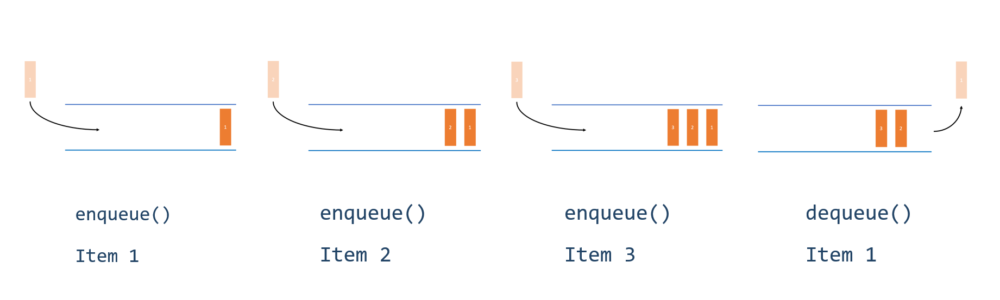

---

# Queue (ADT)

| Operation | Description |
| --- | --- |
|`enqueue(x)`| Add item x to the end of the queue |
|`dequeue()`| Remove the item at the front of the queue and return it |
|`is_empty()`| Check if the queue is empty |
|`is_full()` | Check if the queue is full |
|`peek()` | View the item at the front of the queue without removal |

---

# Priority Queue

Queue in which items are ordered by priority.

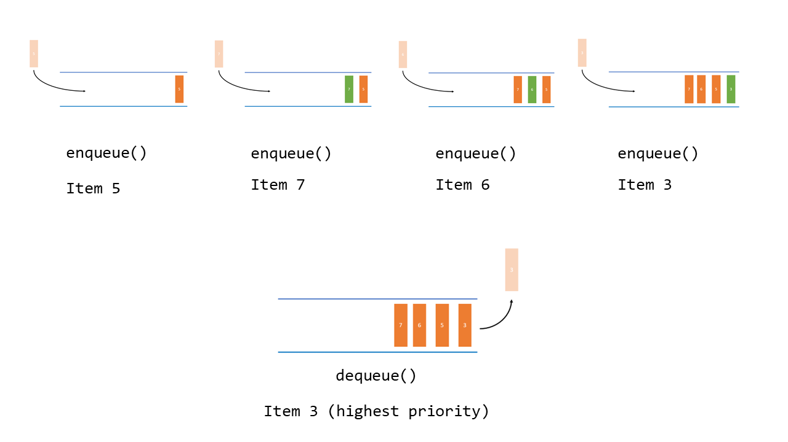

---

# Air Traffic Control Example

- You have scheduled aircraft **X/Y** to land in the next $3/6$ minutes, respectively. 
- Both have enough fuel for at least the next $15$ minutes and both are just $2$ minutes away from your airport. 
- You observe that your airport runway is clear at the moment.

                ✈(Y)
                                 ✈(X)
                                                 (T)
                                                <--->
                                                 |||
                                                 |||
                                         ________|||_____________

[Visualgo.net](https://visualgo.net/en/heap?slide=1)

---

# Air Traffic Control Example

- Suddenly, you receive an urgent SOS message that another aircraft **Z** is running out of fuel and request to land soon. 
- The pilot of aircraft **Z** estimates that he only have 3 minutes of flying time and also approximately $3$ minutes away from your airport...

 
 
    ✈(Z)
                  ✈(Y)
                                 ✈(X)
                                                 (T)
                                                <--->
                                                 |||
                                                 |||
                                         ________|||_____________

---

# Air Traffic Control Example

Do you?

- Let aircraft **Z** land first and hold **X** and **Y**
- Stick with the original plan

---

# Priority Queue (ADT)

We will look at the max priority queue, but we can do a min priority queue.

Now each item `x` in the queue has an associated `key` (commonly the value of `x`).

| Operation | Description |
| --- | --- |
|`insert(x)`| Insert item `x` based on it's priority (`key`) (like `enqueue(x)`)|
|`extract_max()`| Return the item with the highest priority (`key`) (like `dequeue()`)|
|`is_empty()`| Check if the queue is empty |
|`is_full()` | Check if the queue is full |
|`peek()` | View the item at the front of the queue without removal |

---

# Coding Examples

---

# Using a Binary Heap to Implement a Priority Queue

- We are going to use a **binary heap** data structure to implement a **priority queue**.
- Spoiler - the time complexities are as follows.

| Operation | Average-case Cost | Worst-case Cost |
| --- | :-: | :--: |
|`insert(x)`| $O(1)$ | $O(\log(n))$ |
|`extract_max()`| $O(\log(n))$ | $O(\log(n))$ |
|`peek()` | $O(1)$ | $O(1)$ |

[Discussion on time complexity](https://stackoverflow.com/questions/39514469/argument-for-o1-average-case-complexity-of-heap-insertion)

---

# Binary Tree

  

  A binary tree has:

  - a root node
  - each node has at most two children
    - a left child 
    - a right child

  

  

  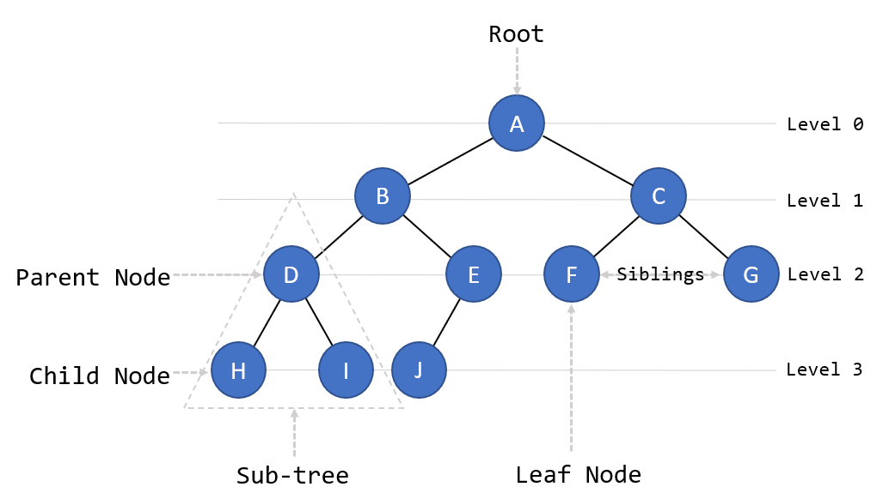

  

---

# Sub-trees

- The root pointer points to the topmost node in the tree. 
- The left and right pointers recursively point to smaller subtrees on either side. 
- A **NULL** pointer represents a subtree with no children.

 

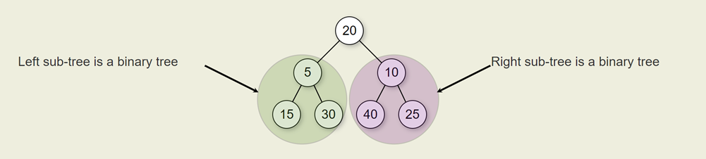

---

# Full Binary Tree

- **Full** - Every node has $0$ or $2$ children

https://towardsdatascience.com/5-types-of-binary-tree-with-cool-illustrations-9b335c430254

Green examples are **full** binary trees.

---

# Complete Binary Tree

- **Complete** - Every level, except possibly the last, is completely filled, and all nodes in the last level are as far left as possible. 

- Height is $\lfloor \log(n) \rfloor$ ($n$ is number of nodes).

https://towardsdatascience.com/5-types-of-binary-tree-with-cool-illustrations-9b335c430254

Green examples are **complete** binary trees.

---

# Perfect Binary Tree

- **Perfect** -  All interior nodes have two children and all leaves have the same depth or same level.
- Height is $\lfloor \log(n) \rfloor$ ($n$ is number of nodes).

https://towardsdatascience.com/5-types-of-binary-tree-with-cool-illustrations-9b335c430254

Green examples are **perfect** binary trees.

---

# Balanced Binary Tree

- **Balanced** -  Left and right subtrees of every node differ in height by no more than 1

https://towardsdatascience.com/5-types-of-binary-tree-with-cool-illustrations-9b335c430254

Green examples are **balanced** binary trees.

---

# Degenerate (Pathological) Binary Tree

- **Degenerate** -  Each parent node has only one associated child node

https://towardsdatascience.com/5-types-of-binary-tree-with-cool-illustrations-9b335c430254

Green examples are **degenerate** binary trees.

---

# Binary Tree Types

https://towardsdatascience.com/5-types-of-binary-tree-with-cool-illustrations-9b335c430254

---

# Binary Heap

- **Data Structure** we can use to efficiently **implement a priority queue**.

- Either:
  - **Max-heap**
  - **Min-heap**
- A **complete** binary tree.
- Every node satisfies the **heap property**.

---

# Max-heap Example

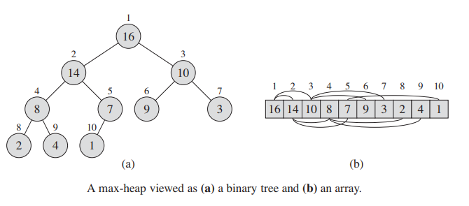

- The root node has the biggest value.
- Every node satisfies the **max-heap property**. 
  - the value of each node is less than or equal than it's parents. 

Does the binary tree in (a) satisfy the **max-heap property**?

---

# TASK

Visit [visualgo.net (Binary Heap)](https://visualgo.net/en/heap)

- Create a binary heap
- Insert an item (Keep doing this until you understand what is happening)
- Extract Max (Keep doing this until you understand what is happening)

Keep an eye on the **max-heap property** for all nodes in the heap.

---

# Maintaining the Max Heap Property

***From now on we will talk about max-heaps***.

When we either: 
- extract the max item (root node)
- insert a new item

We must reorder the nodes so that the **max-heap property** is maintained.

---

# Sift Down

Sifting down on a subtree rooted at index $i$.

Determine the largest of the nodes: 
- `A[i]` (parent)
- `A[left(i)]` (left-child)
- `A[right(i)]` (right-child).

and store the index as `largest`.

1. If `A[i]` is `largest` then subtree satisfies the **max-heap property**.
2. Otherwise, exchange the `A[i]` and `A[largest]`.

---

# Example of Sift Down

***Animation, please move to the next slide...*** 

- Largest of the nodes indexed at $1$, $2$ and $3$ is the node at index $2$ with value $14$. 
- Therefore sift down - Swap nodes indexed at $1$ (parent) and $2$ (left-child).

  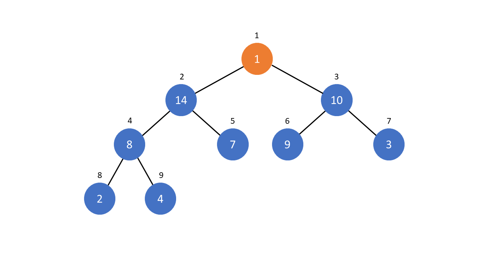

---

# Example of Sift Down

***Animation, please move to the next slide...*** 

- Largest of the nodes indexed at $2$, $4$ and $5$ is the node at index $4$ with value $8$. 
- Therefore sift down - Swap nodes indexed at $2$ (parent) and $4$ (left-child).

  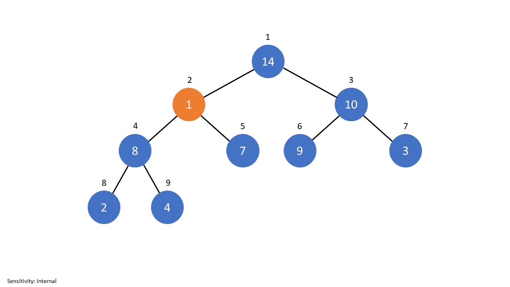

---

# Example of Sift Down

***Animation, please move to the next slide...*** 

- Largest of the nodes indexed at $4$, $8$ and $9$ is the node at index $9$ with value $4$. 
- Therefore sift down - Swap nodes indexed at $4$ (parent) and $9$ (right-child).

  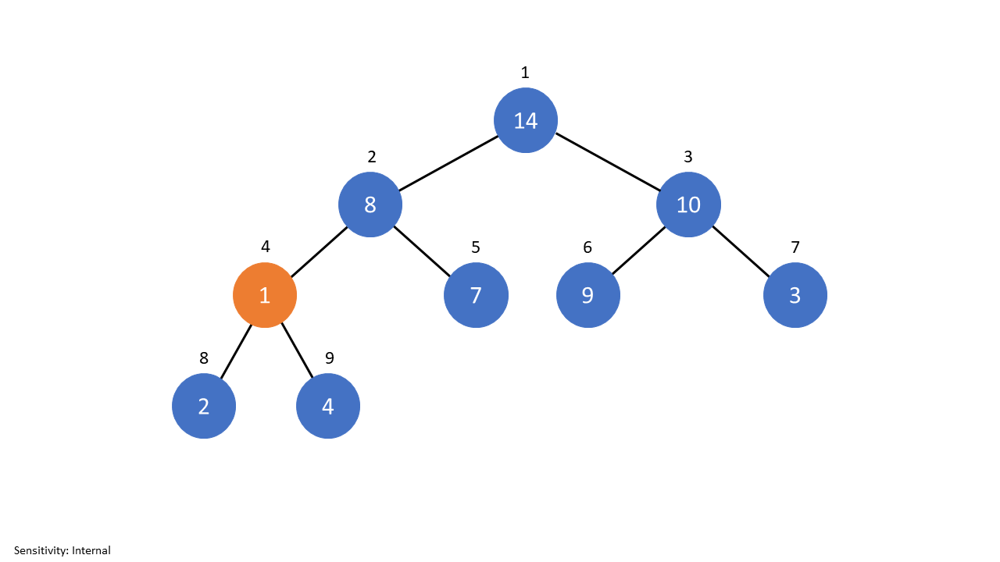

---

# Example of Sift Down

***Animation, please move to the next slide...*** 

- Node with value $1$ is now a leaf node.
 

  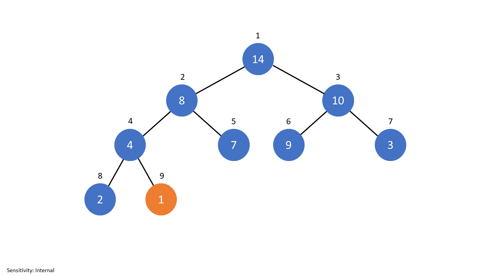

---

# Extracting Max (`extract_max()`)

1. Extract the root node.
2. Make the last node in the tree the root node
3. Sift down the root node until at correct position

***Please try extracting max on [Visualgo.net](https://visualgo.net/en/heap)***

This operation takes $O(log(n))$. 

Why? In the worst-case we have to sift the new root node all the way down to the leaf nodes. Height of complete tree is $\lfloor \log(n) \rfloor$.

---

# Sift Up

Sifting up a node at index $i$.

1. If node at index $i$ is larger than its' parent, i.e. `A[i] > A[parent[i]]`, then exchange. 

This is normally repeated until the above is not true.

---

# Example of Sift Up

***Animation, please move to the next slide...*** 

- Node indexed at $10$ has a value higher than it's parent (node at index $5$).
- Swap index $10$ and index $5$.

  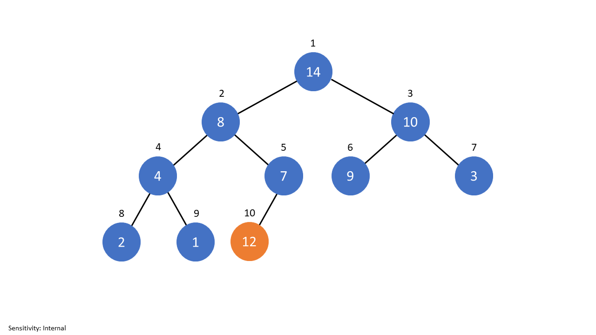

---

# Example of Sift Up

***Animation, please move to the next slide...*** 

- Node indexed at $5$ has a value higher than it's parent (node at index $2$).
- Swap index $5$ and index $2$.

  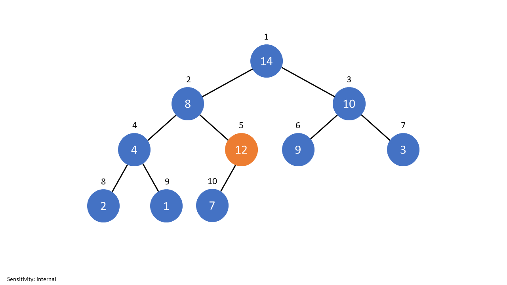

---

# Example of Sift Up

***Animation, please move to the next slide...*** 

- Node indexed at $2$ has a value higher than it's parent (node at index $1$).
- No swap required.

  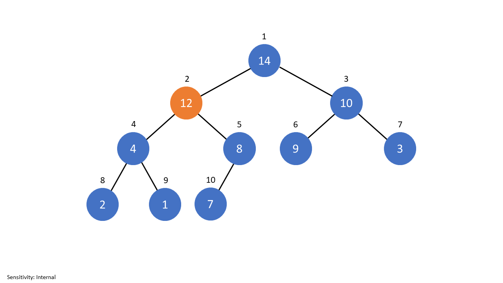

---

# Inserting an Item (`insert(x)`) - Sift Up

1. Insert item into next available node in the heap.
2. Sift the node up until in the correct position.

***Please try inserting on [Visualgo.net](https://visualgo.net/en/heap)***

This operation takes $O(log(n))$. 

Why? 

- In the worst-case we have to sift the new node all the way up to the root node. 
- Height of complete binary tree with $n$ nodes is $\lfloor log(n) \rfloor$.

---

# Heapsort (not in-place)

- If you have a max-heap (min-heap) just keep extracting the max (min).  This gives descending (ascending) order. 

### Time Complexity

- It takes $O(n)$ to create the heap. 
- Extraction costs $O(log(n))$ and we do this $n$ times. 

$O(n) + O(n\log(n)) = O(n\log(n))$. Thus $O(n\log(n))$. Note we can get a tighter bound.

### Space complexity

We need to maintain a separate copy of the list. Thus $O(n)$.

---

# Heapsort

This is the standard version.

- Sorts in-place
- Stable (preserves order of items that are equal)
- Worst-cast time complexity - $O(n\log(n))$
- Space complexity - $O(1)$

***I have implemented this for you on the module. Doesn't require extra space***.

---

# Other Uses of Priority Queues

- Scheduling 
- Event-driven simulation
- Bandwith management
- Efficient **Shortest Path** calculation

---

# Summary

- Priority queue is a queue where items are ordered by priority
- We can use a binary heap to implement a priority queue

| Operation | Worst-case Cost |
| --- | :-: |
|`insert(x)`| $O(\log(n))$ |
|`extract_max()`|  $O(\log(n))$ |
|`peek()` |  $O(1)$ |

- A binary heap is a complete binary tree that satisfies the heap property
  - Either max-heap or min-heap
- Heapsort has wosrt-case time complexity $O(n\log(n))$ and space complexity $O(1)$

---

# References

Cormen, T.H., Leiserson, C.E., Rivest, R.L. and Stein, C., 2022. Introduction to algorithms. MIT press.
