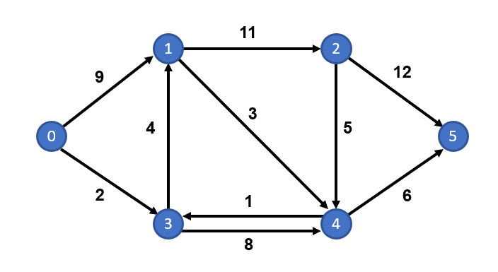
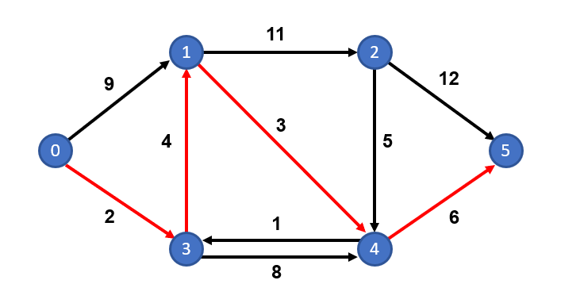
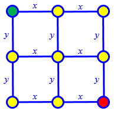
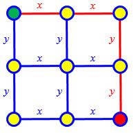
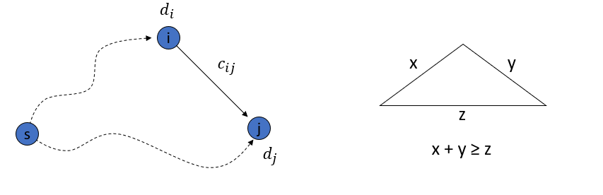
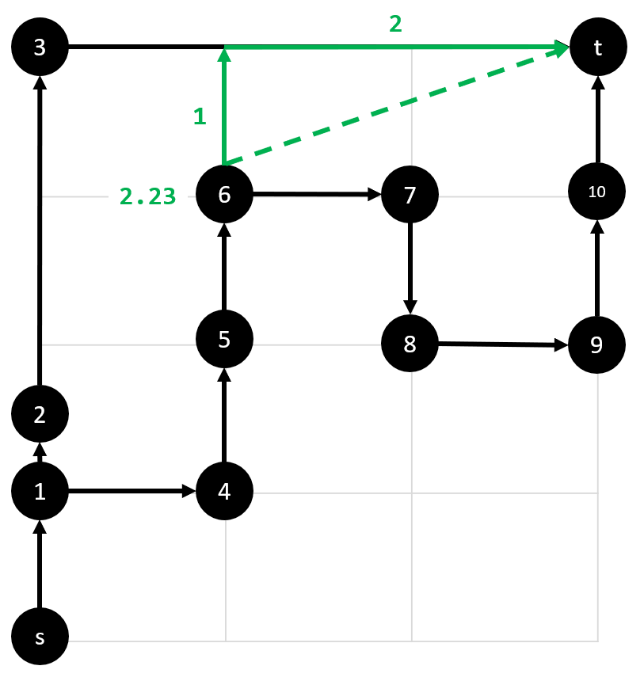
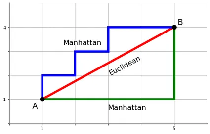

<style>
div.colwrap {
  background-color: inherit;
  color: inherit;
  width: 100%;
  max-height: 80%;
}
div.colwrap div h1:first-child, div.colwrap div h2:first-child {
  margin-top: 0px !important;
}
div.colwrap div.left, div.colwrap div.right {
  /*position: relative;*/
  top: 0;
  bottom: 0;
  /*padding: 70px 35px 70px 70px;*/
}
div.colwrap div{
    float: left
}
div.colwrap div.left {
  width: 50%;
}
div.colwrap div.right {
  width: 50%;
}
#growth_rates{
  font-size:20px;
}
</style>

<center>

<center>

# Lecture 21 - Pathfinding Algorithms (Single Source)

## Computer Systems, Data Structures, and Data Management (4CM508)

### Dr Sam O'Neill

</center>

---

# Pathfinding Demonstrations

[Interactive Pathfinding Playground](https://qiao.github.io/PathFinding.js/visual/)

[Visualalgo.net - Single-source Shortest Paths](https://visualgo.net/en/sssp?slide=1)

---

# Why?


- GPS Navigation
- Video Games (NPCs)
- Robotics
- Logistics (Transportation of Goods)
- Network Routing

---

# Blue Peter Example



What is the shortest path from $0$ to $5$?


---

# Blue Peter Example



Shortest path between $0$ and $5$ is $0-3-1-4-5$ of length $15$.


---

# Paths

### Walk

A walk is a sequence of vertices and edges of a graph.

### Path

A path is a walk without repeated vertices. e.g. the edges in red are a path!

<style>
#blue_peter_sssdpp1 img{
  height:200px;
}
</style>

<div id="blue_peter_sssdpp1">

  

</div>

---

# Single-source Shortest Path Problem

Find the shortest paths from a source $s$ to **all other** vertices in the graph.

## Single-pair Shortest Path Problem

Find the shortest paths from a source $s$ to a destination $t$ in the graph.


<style>
#blue_peter_sssdpp2 img{
  height:300px;
}
</style>

<div id="blue_peter_sssdpp2">

  

</div>

---

# Naive approach

- Search all the paths and work out there distance
- Pick the path with minimum distance

---

# Number of Paths in a Grid (Corner to Corner)

<div>

| $4 \times 4$ Grid | Example Path - $xxyy$ |
| -- | -- | 
 |  |

</div>

You need 2 $x$'s and 2 $y$'s to get from $s$ (green vertex) to $t$ (red vertex).

Thus total number of paths is the number of ways you can write down 2 $x$'s and 2 $y$'s.

e.g. $xxyy$, $xyxy$, $xyyx$, $yxxy$, $yxyx$ and $yyxx$.

That is 6 paths.

---

# Number of Paths From $s$ to $t$

I won't dwell on the mathematics. If you are interested then look [here](https://www.themathdoctors.org/how-many-paths-from-a-to-b/).

However, in a $4 \times 4$ grid  like the previous example there are ${4 \choose 2} = \frac{4!}{2!2!}=6$ paths.

For an $n \times n$ grid there are ${2n \choose n} = \frac{(2n)!}{n!n!}$ 

<br>

<div>

| Grid Size | No Paths |
| :--: | :--: |
|$8 \times 8$ | $12,870$ |
|$20 \times 20$ | Approximately $1.38 \times 10^{11}$  (one hundred and thirty billion) |

</div>


These are very small. It is also much worse for a dense graph!

**KEY POINT: It is impossible to search all paths!**

---

# Context

There are an estimated $10^{78}$ to $10^{82}$ atoms in the universe.

<br>

A $140 \times 140$ grid has approximately $10^{82}$

That is a very very very very small graph! Oh dear!

---

# Shortest Path Triangle Inequality

Imagine you know some path $p_j$ from node $s$ to node $j$ that has a distance $d_j$




Then for that path $p$ to be the shortest path:

The distance from $s$ to $i$ + the cost of edge $(i,j)$ **must be greater** than the current cost of reaching $d_j$ for all edges $(i,j)$.


$d_i + c_{ij} \geq d_j \quad \forall (i,j) \in E$ 


---

# Getting a Better Shortest Path

If for a path $p_j$ from $s$ to $j$, there exists a vertex $i$ where:

$d_i + c_{ij} < d_j$


Then update the distance $d_{ij}$ to path $p_j$ to be:

$d_j = d_i + c_{ij}$

---

# Dijkstra's Algorithm

Computes all the shortest paths from a source $s$ to **all other** vertices in the graph.

1. Initialise the network, source vertex has a distance of $0$ and all other vertices a distance of $\infty$, label all vertices as temporary
2. Label the temporary vertex with minimum distance as permanent 
3. Update the distances and predecessors to reachable temporary vertices from the current permanent vertex
4. Repeat steps 2 and 3 until all vertices visited

This is a set of broad steps. We will see Python Code shortly.

---

# Animations

Please see the animations on the module, it is the best way to learn what this algorithm is doing.


---

# Using a Priority Queue

Having seen the animations, how do we track the distances and select the minimum each time?

With a priority queue!

- As you explore the graph, store the best know distance to vertex $i$.
- Select the vertex with minimum distance to be processed next.

---

# Pseudocode

```
// https://en.wikipedia.org/wiki/Dijkstra%27s_algorithm
1  function Dijkstra(Graph, source):
2      dist[source] ← 0                           // Initialization
3
4      create vertex priority queue Q
5
6      for each vertex v in Graph.Vertices:
7          if v ≠ source
8              dist[v] ← INFINITY                 // Unknown distance from source to v
9              prev[v] ← UNDEFINED                // Predecessor of v
10
11         Q.add_with_priority(v, dist[v])                   
12
13
14     while Q is not empty:                      // The main loop
15         u ← Q.extract_min()                    // Remove and return best vertex
16         for each neighbor v of u:              // Go through all v neighbors of u
17             alt ← dist[u] + Graph.Edges        // alternative distance(u, v)
18             if alt < dist[v]:
19                 dist[v] ← alt
20                 prev[v] ← u
21                 Q.decrease_priority(v, alt)    // Update the distance of vertex v
22
23     return dist, prev
```

---

# Python Code

You can find Python code on the module

---


# Proof of Optimality

The path found by the Dijkstra's will be the optimal shortest path.

We won't look at this, but you can read about it [here](https://en.wikipedia.org/wiki/A*_search_algorithm#Termination_and_completeness).

Or just read any good book or article on the topic. e.g. -  CLRS -Introduction to Algorithms

---

# Time Complexity

Dijkstra’s Algorithm has a worse case time complexity of:

- $O(|V|^2 \log(|V|))$ with an adjacency list 
- $O((|V| + |E|) \log(|V|))$ with a binary heap
- Can get better, $O(|E| + |V| \log(|V|))$ with a Fibonacci heap

For a complete graph the number of edges $|E|$ is $O(|V|^2)$.

So efficient if the number of edges is small, otherwise the algorithm tends to be quadratic.

If you are interested see - CLRS -Introduction to Algorithms

---

# Space Complexity

We maintain a list of permanent vertices $O(|V|)$ and min-priority queue of vertices $O(|V|)$ to be processed. Thus $O(|V|)$.


If you are interested see - CLRS -Introduction to Algorithms

---

# A* Algorithm

If we are focusing on a single destination we can do better!

## Idea

- Maintain an estimate for each vertex in the graph to the destination vertex $t$
- Update Dijkstra's algorithm to select the next vertex to process based on:
Total Estimated Distance = Minimum Distance from $s$ + Heuristic Distance to $t$
- Stop when we reach the goal

One way to think about this is Dijkstra's distance heuristic is just $0$.
- So it selects based on the minimum distance from $s$ (as before)

---

# Example

Maintain the straight-line distance from each vertex to the destination vertex.

Here we measure the distance between vertices and the destination $t$. e.g. vertex $6$ to $t$

<style>
#euclidean_dist img{
  height:300px;
}
</style>

<div id="euclidean_dist">



</div>

You can think of it as seeking the destination.

[Interactive Pathfinding Playground](https://qiao.github.io/PathFinding.js/visual/)

---

# Heuristic Function

The heuristic function is the estimate from vertex $n$ to vertex $t$.

Total Estimated Distance = Shortest Distance from $s$ + Heuristic Distance to $t$

$f(n) = g(n) + h(n)$

- $n$ is vertex
- $g(n)$ is the **calculated** distance from source $s$ to $n$
- $h(n)$ is the **estimated** distance from source $n$ to $t$
- $f(n)$ is the total estimated distance

---

# Euclidean and Manhattan Distance

### Euclidean Distance

Here the estimated distance is the straight line distance.

### Manhattan

Also known as the rectilinear and taxi-cab distance.



----


# Worked example - Euclidean


https://www.101computing.net/a-star-search-algorithm/

---


# Pseudocode

```
// This assumes heuristic(v) is consistent and admissable
1  function AStar(Graph, source, goal):
2      dist[source] ← 0                           // Initialization
3
4      create vertex priority queue Q
5
6      for each vertex v in Graph.Vertices:
7          if v ≠ source
8              dist[v] ← INFINITY                 // Unknown distance from source to v
9              prev[v] ← UNDEFINED                // Predecessor of v
10
11         Q.add_with_priority(v, dist[v])
12
13
14     while Q is not empty:                      // The main loop
15         u ← Q.extract_min()                    // Remove and return best vertex
16         if u = goal:
17             return dist, prev
18         for each neighbor v of u:              // Go through all v neighbors of u
19             alt ← dist[u] + Graph.Edges + heuristic(v)       // Estimated alternative distance(u, v)
20             if alt < dist[v]:
21                 dist[v] ← alt
22                 prev[v] ← u
23                 Q.decrease_priority(v, alt)    // Update the distance of vertex v
24
25     return None
```

---

# Python Code

You can find Python code on the module. 

---

# Proof of Correctness

The path found by the A* algorithm will be the shortest path if the heuristic is:

- admissable
- consistent

Together these guarantee that **the heuristic never overestimates the true cost**. 

***Note there is more to this, but it summarised the main point***

If you are interested you can look them up or read about it [here](https://en.wikipedia.org/wiki/A*_search_algorithm).

Or just read any good book or article on the topic.

---

# Time Complexity

This depends on the heuristic and is beyond the scope of this course.

It is enough to state that the worst-case is **exponential** if the heuristic is bad and the branching factor (average number of adjacent vertices a vertex has - i.e. its neighbours) is high.

With a good heuristic, it will have a worst-case time complexity similar to Dijkstra's, but on average outperforms it.


---

# Summary

- Algorithms used in the real-world, every second of every day.
- Dijkstra's algorithm finds the shortest path.
  - Time Complexity
    - $O(|V|^2 \log(|V|))$ with an adjacency list 
    - $O((|V| + |E|) \log(|V|))$ with a binary heap
    - Can get better, $O(|E| + |V| \log(|V|))$ with a Fibonacci heap
  - Space Complexity
    - $O(|V|)$
- A* algorithm also finds the shortest path
  - Uses a heuristic function to estimate the distance to the destination
  - Common heuristic functions are Euclidean and Manhattan distance

---

# References

Cormen, T.H., Leiserson, C.E., Rivest, R.L. and Stein, C., 2022. Introduction to algorithms. MIT press.

[Visualgo.net - Graphs](https://visualgo.net/en/graphds)

[Interactive Pathfinding Playground](https://qiao.github.io/PathFinding.js/visual/)

https://www.themathdoctors.org/how-many-paths-from-a-to-b/

http://theory.stanford.edu/~amitp/GameProgramming/AStarComparison.html