<style>
div.colwrap {
  background-color: inherit;
  color: inherit;
  width: 100%;
  max-height: 80%;
}
div.colwrap div h1:first-child, div.colwrap div h2:first-child {
  margin-top: 0px !important;
}
div.colwrap div.left, div.colwrap div.right {
  /*position: relative;*/
  top: 0;
  bottom: 0;
  /*padding: 70px 35px 70px 70px;*/
}
div.colwrap div{
    float: left
}
div.colwrap div.left {
  width: 50%;
}
div.colwrap div.right {
  width: 50%;
}
#growth_rates{
  font-size:20px;
}
</style>

<!-- <center>

<center> -->

# Lecture 16 - Binary Search Trees and AVL Trees 

## Foundations of Computer Science (4CC505)

### Dr Sam O'Neill

<!-- </center> -->

---
<!-- 
# Deadlines and In-class Test

| | Date |
| :--: | :--: |
|Lab 5| **Thursday 04/05/2023 - 12:00 (Noon)** |
|Lab 6| **Friday 02/06/2023 - 12:00 (Noon)** |
|Lab 7| **Friday 02/06/2023 - 12:00 (Noon)** |
|Lab 8| **Friday 02/06/2023 - 12:00 (Noon)** |
| Review Quizzes | **Friday 02/06/2023 - 12:00 (Noon)** |
| In-class Test | **Tutorial slot in week beginning ** - 15/05/2023** |

** This is the last week of teaching.

--- -->


I highly recommend that you use the e-lecture mode on [Visualgo.net](https://visualgo.net/en/bst) for both

- Binary Search Trees
- AVL Trees


---

# Trees

Formally:

**Free Tree** is a connected, acyclic, undirected graph.

- Connected - can reach all nodes from any node in graph
- Acyclic - does not contain any cycles
- Undirected - can move along edge either way. e.g. 2 way street!

<style>
#tree_examples img{
  height:200px;
}
</style>

<div id="tree_examples">

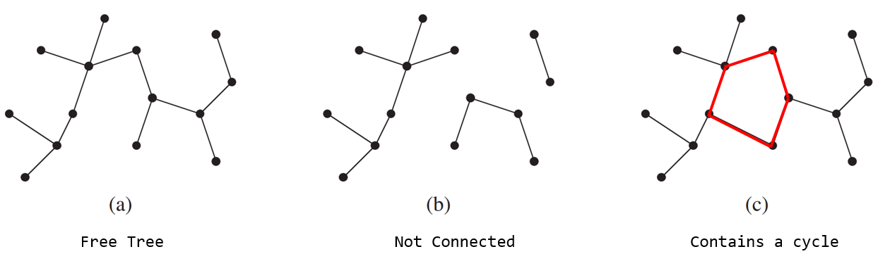

</div>


---

# Binary Tree

<div class="colwrap">

  <div class="left">
  A binary tree has:

  - a root node
  - each node has at most two children
    - a left child 
    - a right child

  </div>
  <div class="right inverted">

  

  </div>
</div>

---

# Full Binary Tree

- **Full** - Every node has $0$ or $2$ children


<span style="font-size:10pt">

https://towardsdatascience.com/5-types-of-binary-tree-with-cool-illustrations-9b335c430254

</span>

Green examples are **full** binary trees.

---

# Complete Binary Tree

- **Complete** - Every level, except possibly the last, is completely filled, and all nodes in the last level are as far left as possible. 

- Height is $\lfloor \log(n) \rfloor$ ($n$ is number of nodes).


<span style="font-size:10pt">

https://towardsdatascience.com/5-types-of-binary-tree-with-cool-illustrations-9b335c430254

</span>

Green examples are **complete** binary trees.

---

# Perfect Binary Tree

- **Perfect** -  All interior nodes have two children and all leaves have the same depth or same level.
- Height is $\lfloor \log(n) \rfloor$ ($n$ is number of nodes).


<span style="font-size:10pt">

https://towardsdatascience.com/5-types-of-binary-tree-with-cool-illustrations-9b335c430254

</span>

Green examples are **perfect** binary trees.

---

# Balanced Binary Tree

- **Balanced** -  Left and right subtrees of every node differ in height by no more than 1


<span style="font-size:10pt">

https://towardsdatascience.com/5-types-of-binary-tree-with-cool-illustrations-9b335c430254

</span>

Green examples are **balanced** binary trees.

---

# Degenerate (Pathological) Binary Tree

- **Degenerate** -  Each parent node has only one associated child node


<span style="font-size:10pt">

https://towardsdatascience.com/5-types-of-binary-tree-with-cool-illustrations-9b335c430254

</span>

Green examples are **degenerate** binary trees.

---

# Binary Tree Types


<span style="font-size:10pt">

https://towardsdatascience.com/5-types-of-binary-tree-with-cool-illustrations-9b335c430254

</span>

---

# Binary Search Trees (BST)

- Binary Tree $T$
- Node $x$ contains
  - a value - $x.key$
  - left-child node - $x.left$
  - right-child node - $x.right$
  - parent node - $x.parent$
- Each node satisfies the **binary search tree (BST) property**
    - If $y$ is a node in the **left subtree** of $x$ then $y.key \leq x.key$
    - If $y$ is a node in the **right subtree** of $x$ then $y.key \geq x.key$

---

# Binary Search Tree (BST) Property

- Each node satisfies the **binary search tree (BST) property**
    - If $y$ is a node in the **left subtree** of $x$ then $y.key \leq x.key$
    - If $y$ is a node in the **right subtree** of $x$ then $y.key \geq x.key$

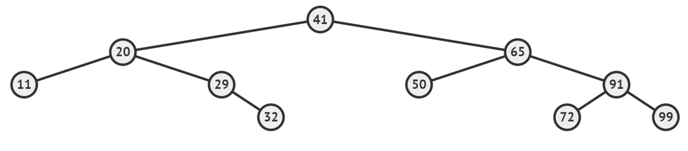

---

# Why?

- We can store order!
- Fast search - average-case is $O(\log(n))$

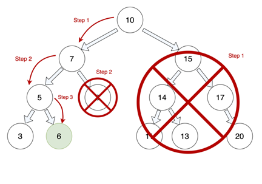

Here the **BST** has $n=12$ nodes, so takes $\lfloor \log_2(12) \rfloor = 3$ steps to find $6$.


---

# Not a Unique Representation

It is not guaranteed that the BST represents things uniquely.

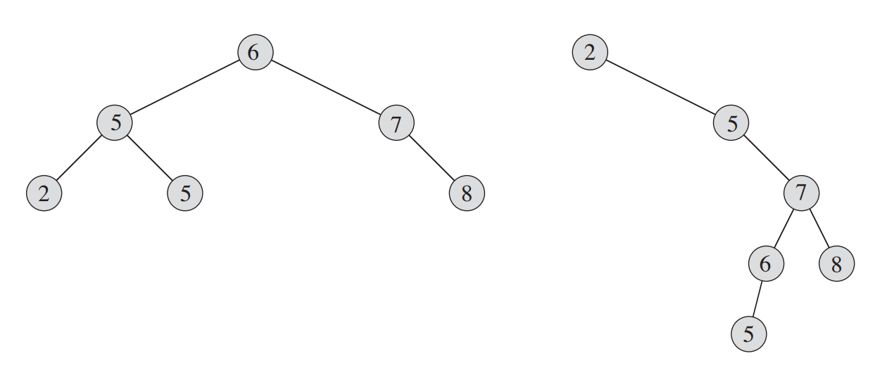

---

# Skewed Right

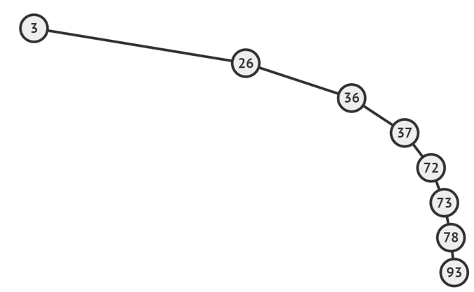

---

# Skewed Left

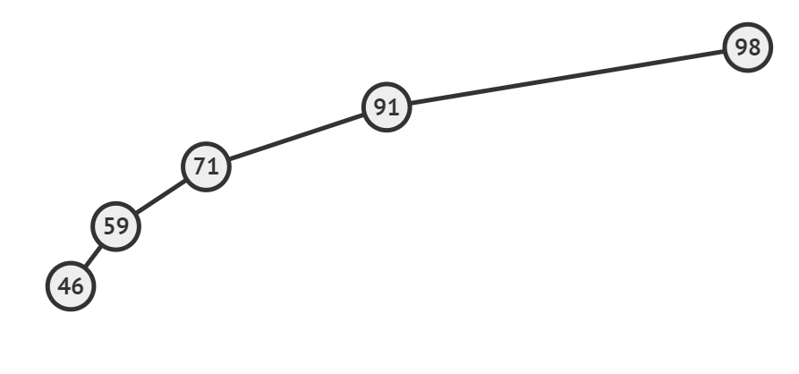

---


# Binary Search Tree Operations

- `search()`
- `minimum()`
- `maximum()`
- `insert()`

There are also two other operations:

- `delete()`
- `predecessor()`
- `successor()`

These are more complicated and we leave you to explore these. Chapter 12 (BST) of CLRS - Intro to Algorithms explains all of these. Also check out [Visualgo.net - BST e-Lecture Mode](https://visualgo.net/en/bst).

---

# Search

<div class="colwrap">

  <div class="left">

  ```python
  def search(T, k):

    x = T.root # set node to root node of tree

    # repeat until x found or x None
    while x != None and k != x.key
      # if key less than nodes key
      if k < x.key:
        # set x to left-child
        x = x.left
      else:
        # set x to right-child
        x = x.right
    
    # return either found node or None
    return x

  ```

  </div>

  <div class="right inverted">

  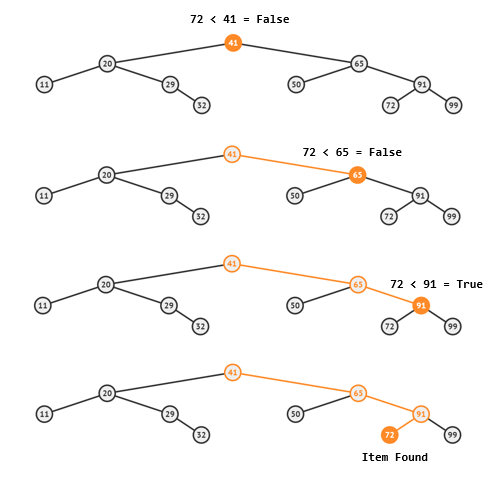

  </div>

</div>

---

# Minimum

Simple, just keep going left!

<div class="colwrap">

  <div class="left">

  ```python
    def minimum(T):
      x = T.root # set node to root node of tree

    # repeat until x found or x None
    while x.left != None
        x = x.left

    return x
  ```

  </div>
  <div class="right inverted">

  

  </div>
</div>

---

# Maximum

Simple, just keep going right!

<div class="colwrap">

  <div class="left">

  ```python
    def maximum(T):
      x = T.x # set node to root node of tree

    # repeat until x found or x None
    while x.right != None
        x = x.right

    return x
  ```

  </div>
  <div class="right inverted">

  

  </div>
</div>

---

# Insertion

<div class="colwrap">

  <div class="left">

  ```python
    def insert(T, z):
      """ Insert node x into BST T """
      y = None
      x = T.root # set node to root node of tree

    # find parent (insertion node) and set y = parent         
    while x != None
      y = x
      if z.key < x.key:
        x = x.left
      else:
        x = x.right

    # set node z's parent to y
    z.parent = y

    if y == None:       # tree is empty
      T.root = z
    elif z.key < y.key: # insert to left
      y.left = z
    else:               # insert to left
      y.right = z

    return x
  ```
  
  </div>

  <div class="right inverted">

  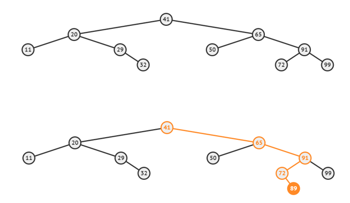

  </div>

</div>

---

# Deletion

This requires transplanting a node - which is more complicated.

Please see chapter 12 (BST) of CLRS - Intro to Algorithms for an explanation.

You can also use the e-lecture mode on [Visualgo.net](https://visualgo.net/en/bst).

---

# Time Complexities

Because we can have skewed left and skewed right binary search trees.

We may have to visit $n$ nodes when searching, inserting and deleting. 

Therefore worst-case is $O(n)$.

<div>

| | Average-case | Worst-case |
| :--: | :--: | :--: |
|`search()`|$O(\log(n))$|$O(n)$|
|`maximum()`|$O(\log(n))$|$O(n)$|
|`minimum()`|$O(\log(n))$|$O(n)$|
|`delete()`|$O(\log(n))$|$O(n)$|
|Space | $O(n)$ | $O(n)$ |

</div>

---

# Can we do better?

Yes, if we keep the binary search tree **balanced**.

- **Balanced** -  Left and right subtrees of every node differ in height by no more than 1


---

# AVL Trees

There are a number of self-balancing binary search trees.

We will explore AVL Trees.

- Named after inventors Adelson-Velsky and Landis
- Similar to another type called red-black trees


---

# Height of a Node (Vertex)

The **height** of a node $x$ - $x.height$ is defined as:

The number of edges in the path to node $x$'s deepest leaf node.

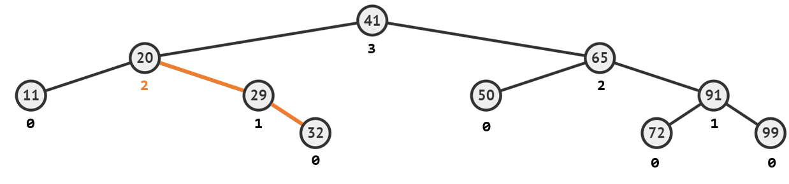

---

# AVL Tree Invariant

Define the balance factor of node $x$ as:

$BF(x) := x.left.height - x.right.height$

Then the AVL Tree invariant is:

$BF(x) \in \{-1,0,1\}$

which holds for every node $x$.


---

# AVL Tree Invariant - Holds

Here the AVL Tree invariant holds. 
- Height in <span style="color:red">**red**</span>
Balance Factor in <span style="color:green">**green**</span>
  - $BF(x) := x.left.height - x.right.height$

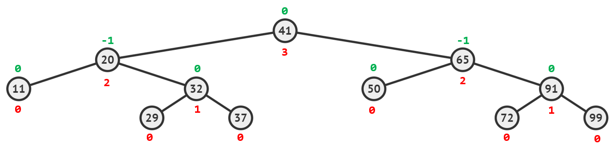

---

# AVL Tree Invariant - Does Not Hold

Here the AVL Tree invariant **DOES NOT** hold.

- Height in <span style="color:red">**red**</span>
Balance Factor in <span style="color:green">**green**</span>

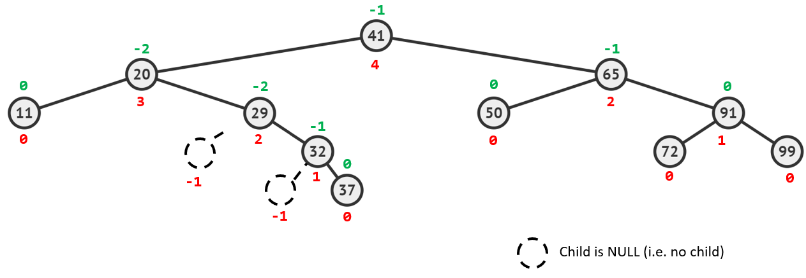

---

# Height of an AVL Tree

The height of an AVL tree is just the height of the root node.

It can be proved (beyond this module) that an BST that satisfies the AVL tree invariant with $n$ nodes has a height of $O(\log(n))$.

Thus all BST operations like search, insert, delete... will now be worst-case $O(\log(n))$.

***However, we now need to check and maintain the AVL tree invariant after insertion and deletion!***

---

# Insertion

Insert as before.

Issue! Tree may be unbalanced. e.g. $37$ inserted into the BST


---

# Rotations

We introduce the idea of a left-rotation and a right-rotation.

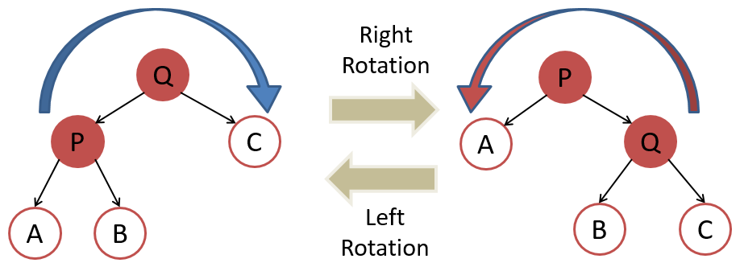

---

# Example

<style>
#example_rotation img{
  width:700px;
}
</style>

<div id="example_rotation">

  

Perform a left-rotation on $29$ and $32$. Tree is then balanced (below).

  

</div>

----

# Four Possible Unbalanced Cases

- Left Rotation (Left Left)
- Right Rotation (Right Right)
- Left Right Rotation (Left Right)
- Right Left Rotation (Right Left)

---

# Four Possible Unbalanced Cases

## Left Rotation (Left Left)

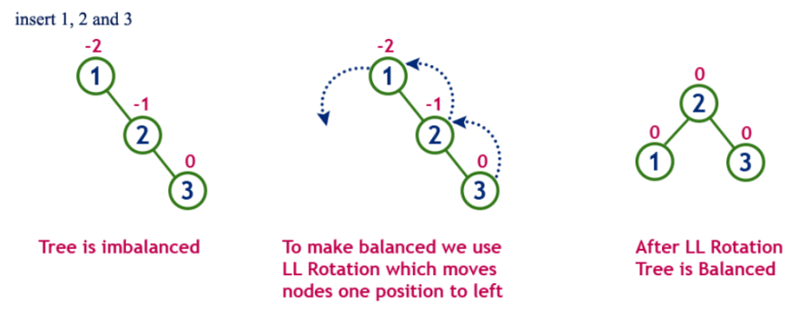

---

# Four Possible Unbalanced Cases

## Right Rotation (Right Right)

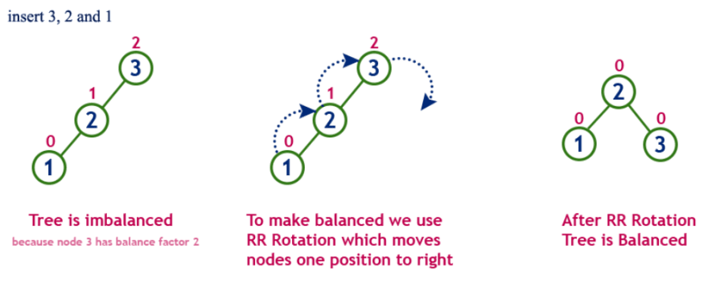

---

# Four Possible Unbalanced Cases

## Left Right Rotation (Left Right)

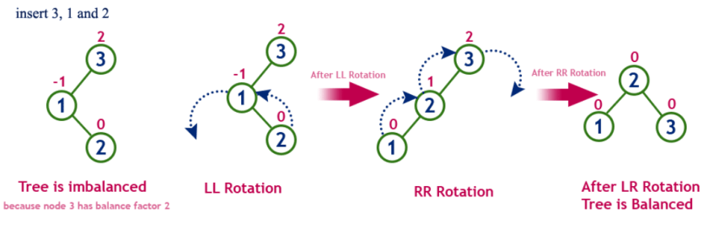

---

# Four Possible Unbalanced Cases

## Right Left Rotation (Right Left)

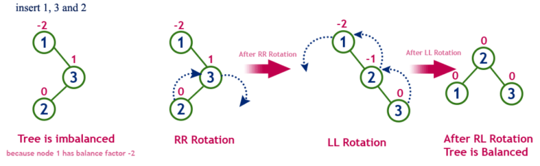

---

# Insertion Algorithm

To insert a node $z$.

1. Insert as normal for a BST
2. Walk up the AVLTree from the insertion point. For every node:
  - Check balance factor, if $2$ or $-2$ then:
    - Rebalance using 1 of the 4 rotation cases

<br>

Please see chapter 12 (BST) of CLRS - Intro to Algorithms for an explanation.

You can also use the e-lecture mode on [Visualgo.net](https://visualgo.net/en/bst).

---

# Deletion Algorithm

To remove a node $z$.

1. Remove as normal for a BST
2. Walk up the AVL Tree from the insertion point. For every node:
  - Check balance factor, if $2$ or $-2$ then:
    - Rebalance using 1 of the 4 rotation cases

<br>

Please see chapter 12 (BST) of CLRS - Intro to Algorithms for an explanation.

You can also use the e-lecture mode on [Visualgo.net](https://visualgo.net/en/bst).
  

---

# Summary

- Binary Search Tree (BST) stores nodes in order
- AVL Tree is a self-balancing BST
  - We do this using rotations

### Worst-case Summary

<div>

| | BST | AVL Tree |
| :--: | :--: | :--: |
|`search()`|$O(n)$|$O(\log(n))$|
|`maximum()`|$O(n)$|$O(\log(n))$ |
|`minimum()`|$O(n)$|$O(\log(n))$ |
|`delete()`|$O(n)$|$O(\log(n))$ |
| **Space** | $O(n)$ | $O(n)$ |

</div>

---

# References

Cormen, T.H., Leiserson, C.E., Rivest, R.L. and Stein, C., 2022. Introduction to algorithms. MIT press.

[Visualgo.net](https://visualgo.net/en/bst)